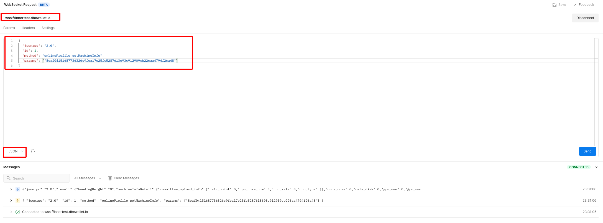

## 自定义 RPC 的查询

说明：可以连接区块链的`websocket接口`进行查询。测试网 WS 接口：`wss://innertest.dbcwallet.io`

查询请求方式：

```json
{
  "jsonrpc": "2.0",
  "id": 1,
  "method": method_name,
  "params": [params_1, params_2...]
}
```

其中，method_name 和 params_1, params_2... 根据需要替换成实际的方法名与参数。

例如，利用 Postman 连接 websocket 查询机器信息：



#### 查询在线奖励模块资金账户数量

- 方法: `onlineProfile_getStakerNum`

- 参数: 无

- 结果示例：

  ```json
  {
    "jsonrpc": "2.0",
    "result": 1,
    "id": 1
  }
  ```

- 结果说明：

  `result` 字段为资金账户数量

#### 查询在线奖励模块统计数据

- 方法: `onlineProfile_getOpInfo`

- 参数： 无

- 结果示例：

```json
{
  "jsonrpc": "2.0",
  "result": {
    "totalBurnFee": "0", // 银河竞赛开启后，租金将被burn
    "totalCalcPoints": 1966150, // 系统中总算力点数
    "totalGpuNum": 218, // 系统中在线GPU数量
    "totalRentFee": "3928735309068010075566", // 银河竞赛开启前，产生的租金数
    "totalRentedGpu": 171, // 被租用的GPU数量
    "totalStake": "22000000000000000000000", // 在线奖励模块质押总数
    "totalStaker": 12 // 算工总数
  },
  "id": 1
}
```

#### 查询资金账户的信息

- 方法：`onlineProfile_getStakerInfo`

- 参数：资金账户。例如 `5HpG9w8EBLe5XCrbczpwq5TSXvedjrBGCwqxK1iQ7qUsSWFc`

- 结果示例：

  ```json
  {
    "jsonrpc": "2.0",
    "result": {
          "bondedMachines": [ // 每个机器的算力点数
              {
                  "calcPoint": 6825, // 机器的算力点数
                  "gpuNum": 4, // 机器的GPU数量
                  "machineId": [56, 101, 97, 102, 48, 52, 49, 53, 49, 54, ...], // 机器的machine_id
                  "machineStatus": "online" // 机器的状态
              }
          ],
          "stashStatistic": {
              "canClaimReward": "1415699994555000000000", // 可以领取的奖励
              "linearReleaseReward": [ // 线性释放的奖励,即每天总奖励减去立即释放的25%奖励后，剩下的75%的奖励。
                  "825000000000000000000",
                  "825000000000000000000",
                  "825000000000000000000", // 前3天的奖励
                  "825000000000000000000", // 前2天的奖励
                  "825000000000000000000" // 前1天的奖励
              ],
              "onlineMachine": [
                  [56, 101, 97, 102, 48, 52, 49, 53, 49, 54, ...] // 该stash账户上线的机器ID
              ],
              "totalBurnFee": "0", // 银河竞赛开启后，总
              "totalCalcPoints": 6825, // 该账户下，机器的总算力值
              "totalClaimedReward": "0", // 该账户已经领取的奖励数量
              "totalGpuNum": 4, // 该账户下机器的总CPU数量
              "totalMachine": [
                  [56, 101, 97, 102, 48, 52, 49, 53, 49, 54, ...] // 该账户下所有的机器ID
              ],
              "totalRentFee": "0", // 银河竞赛开启前，获得的租金数量
              "totalRentedGpu": 0 // 该账户下机器被租用的GPU数量
          }
      },
    "id": 1
  }
  ```

- 结果说明：

  其中， `machineId`字段为`Vec<u8>`，需要转为`String`类型

  TODO

#### 查询某个 Era（某一天）单台机器获得的奖励数量

- 方法： `onlineProfile_getMachineEraReward`

- 参数： 参数 1：MachineId; 参数 2：EraIndex

- 请求示例(查询某机器在第二天的奖励)：

```json
{
  "jsonrpc": "2.0",
  "id": 1,
  "method": "onlineProfile_getMachineEraReward",
  "params": [
    "2641bc74c63156aa6880a66ad77fe9fdd0da214b7f0fade6fa9138b52e1d065c",
    1
  ]
}
```

- 结果示例：

```json
{
  "jsonrpc": "2.0",
  "result": "0",
  "id": 1
}
```

- 结果说明：result 字段即为当天机器获得的收益数量

#### 查询系统中所有的机器

- 方法：`onlineProfile_getMachineList`

- 参数：无

- 结果示例：

  ```json
  {
  	"jsonrpc": "2.0",
  	"result": {
  		"bondingMachine": [],
  		"bookedMachine": [
  			[56, 101, 97, 102, 48, 52, 49, 53, 49, 54, 56, 55, 55, ...],
              [102, 99, 53, 50, 56, 55, 54,4 9, 51, 54, 57,...]
  		],
  		"confirmedMachine": [],
  		"fulfillingMachine": [],
  		"onlineMachine": [],
  		"refusedMachine": []
  	},
  	"id": 1
  }
  ```

#### 查询机器的信息

- 方法：`onlineProfile_getMachineInfo`

- 参数：`MachineId`. 如：`8eaf04151687736326c9fea17e25fc5287613693c912909cb226aa4794f26a48`

- 结果示例：

  ```json
  {
    "jsonrpc": "2.0",
    "result": {
      "bondingHeight": 1505,
      "machineInfoDetail": {
        "committee_upload_info": {
          "calc_point": 0,
          "cpu_core_num": 0,
          "cpu_rate": 0,
          "cpu_type": [],
          "cuda_core": 0,
          "data_disk": 0,
          "gpu_mem": 0,
          "gpu_num": 0,
          "gpu_type": [],
          "is_support": false,
          "machine_id": [],
          "mem_num": 0,
          "rand_str": [],
          "sys_disk": 0
        },
        "staker_customize_info": {
          "download_net": 1102,
          "images": [
            [85, 98, 117, 110, 116, 117, 49, 56, 46, 48, 52, 32, 76, 84, 83],
            [67, 101, 110, 116, 79, 83, 32, 56]
          ],
          "latitude": 1104,
          "longitude": 1103,
          "telecom_operators": [
            [67, 104, 105, 110, 97, 32, 85, 110, 105, 99, 111, 109],
            [67, 104, 105, 110, 97, 32, 77, 111, 98, 105, 108, 101]
          ],
          "upload_net": 1101
        }
      },
      "machineOwner": "5HpG9w8EBLe5XCrbczpwq5TSXvedjrBGCwqxK1iQ7qUsSWFc",
      "machineStatus": "committeeVerifying",
      "rewardCommittee": [],
      "rewardDeadline": 0,
      "stakeAmount": "100000000000000000",
      "totalBurnFee": "0",
      "totalRentFee": "0",
      "totalRentedDuration": 0,
      "totalRentedTimes": 0
    },
    "id": 1
  }
  ```

#### 查询按经纬度位置区分的 GPU 信息统计

- 方法：`onlineProfile_getPosGpuInfo`

- 参数：无

- 结果示例：

  ```json
  {
    "jsonrpc": "2.0",
    "result": [
      [
        1103,
        1104,
        {
          "offlineGpu": 0,
          "onlineGpu": 4,
          "onlineGpuCalcPoints": 6825,
          "rentedGpu": 0
        }
      ]
    ],
    "id": 1
  }
  ```

### 分页查询矿工质押详情

```json
{
  "jsonrpc": "2.0",
  "id": 1,
  "method": "onlineProfile_getStakerListInfo",
  "params": [0, 7]
}
```

- 参数说明：cur_page, per_page

返回结果：

```json
{
    "jsonrpc": "2.0",
    "result": [
        {
            "calcPoints": 6825,
            "index": 1,
            "stakerAccount": "5HpG9w8EBLe5XCrbczpwq5TSXvedjrBGCwqxK1iQ7qUsSWFc",
            "stakerName": [],
            "totalBurnFee": "0",
            "totalGpuNum": 4,
            "totalRentFee": "0",
            "totalRentedGpu": 0,
            "totalReward": "0"
        },
        {}...
    ],
    "id": 1
}
```

---

---

### 查询机器列表

```bash
curl http://localhost:9933 -H "Content-Type:application/json;charset=utf-8" -d   '{
     "jsonrpc":"2.0",
      "id":1,
      "method":"onlineProfile_getMachineList",
      "params": []
    }'
```

- 返回信息：

```json
{
    "jsonrpc": "2.0",
    "result": {
        "bondingMachine": [],
        "bookedMachine": [],
        "confirmedMachine": [],
        "fulfillingMachine": [],
        "onlineMachine": [
            [102, 99, 53, 50, 56, 55, 54,4 9, 51, 54, 57,...]
        ],
        "refusedMachine": []
    },
    "id": 1
}
```

结果说明：TODO

### 查询委员会被分配的机器 ID

```bash
 curl http://localhost:9933 -H "Content-Type:application/json;charset=utf-8" -d   '{
     "jsonrpc":"2.0",
      "id":1,
      "method":"leaseCommittee_getCommitteeMachineList",
      "params": ["5GrwvaEF5zXb26Fz9rcQpDWS57CtERHpNehXCPcNoHGKutQY"]
    }'
```

参数说明：committeeAccountId

返回结果:

```json
{
    "jsonrpc": "2.0",
    "result": {
        "bookedMachine": [],
        "confirmedMachine": [],
        "hashedMachine": [],
        "onlineMachine": [
            [102, 99, 53, 50, 56, 55, 54,4 9, 51, 54, 57,...]
        ]
    },
    "id": 1
}
```

### 查询委员会验证时间

```bash
curl http://localhost:9933 -H "Content-Type:application/json;charset=utf-8" -d   '{
     "jsonrpc":"2.0",
      "id":1,
      "method":"leaseCommittee_getCommitteeOps",
      "params": ["5GrwvaEF5zXb26Fz9rcQpDWS57CtERHpNehXCPcNoHGKutQY", "8eaf04151687736326c9fea17e25fc5287613693c912909cb226aa4794f26a48"]
    }'
```

参数说明： committeeAccountId, machineId

返回结果：

```json
{
  "jsonrpc": "2.0",
  "result": {
    "bookedTime": "0",
    "confirmHash": [0, 0, 0, 0, 0, 0, 0, 0, 0, 0, 0, 0, 0, 0, 0, 0],
    "confirmTime": "0",
    "hashTime": "0",
    "machineInfo": {
      "calc_point": 0,
      "cpu_core_num": 0,
      "cpu_rate": 0,
      "cpu_type": [],
      "cuda_core": 0,
      "gpu_mem": 0,
      "gpu_num": 0,
      "gpu_type": [],
      "hard_disk": 0,
      "is_support": false,
      "machine_id": [],
      "mem_num": 0,
      "rand_str": []
    },
    "machineStatus": "Booked",
    "stakedDbc": "0"
  },
  "id": 1
}
```

### 查询用户租用机器订单

```bash
curl http://localhost:9933 -H "Content-Type:application/json;charset=utf-8" -d   '{
     "jsonrpc":"2.0",
      "id":1,
      "method":"rentMachine_getRentOrder",
      "params": ["8eaf04151687736326c9fea17e25fc5287613693c912909cb226aa4794f26a48", "5GrwvaEF5zXb26Fz9rcQpDWS57CtERHpNehXCPcNoHGKutQY"]
    }'
```

参数说明： AccountId, MachineId

返回结果：

```json
{
  "jsonrpc": "2.0",
  "result": {
    "confirmRent": "0",
    "rentEnd": "0",
    "rentStart": "0",
    "renter": "5C4hrfjw9DjXZTzV3MwzrrAr9P1MJhSrvWGWqi1eSuyUpnhM",
    "stakeAmount": "0"
  },
  "id": 1
}
```

### 查询用户的租用列表

```json
curl http://localhost:9933 -H "Content-Type:application/json;charset=utf-8" -d   '{
     "jsonrpc":"2.0",
      "id":1,
      "method":"rentMachine_getRentList",
      "params": ["5GrwvaEF5zXb26Fz9rcQpDWS57CtERHpNehXCPcNoHGKutQY"]
    }'
```

参数说明：AccountId

返回结果： ["machine_id1", "machine_id2"]

---

---

### 查询矿工的质押数量

```bash
curl http://localhost:9933 -H "Content-Type:application/json;charset=utf-8" -d   '{
     "jsonrpc":"2.0",
      "id":1,
      "method":"onlineProfile_getStakerInfo",
      "params": ["5GjrZ4iQdxZhAKKjNooMruGqBwH5CwbJ6Un6Cinc7j45zToE"]
    }'
```

- "params"为： "AccountId"

- 返回信息：

```json
{
  "jsonrpc": "2.0",
  "result": { "calcPoints": 0, "gpuNum": 0, "totalReward": "0" },
  "id": 1
}
```

### 查询地址对应的账户名称

```bash
curl http://localhost:9933 -H "Content-Type:application/json;charset=utf-8" -d   '{
     "jsonrpc":"2.0",
      "id":1,
      "method":"onlineProfile_getStakerIdentity",
      "params": ["5FHneW46xGXgs5mUiveU4sbTyGBzmstUspZC92UhjJM694ty"]
    }'
```

- 返回信息：

```json
{ "jsonrpc": "2.0", "result": [98, 111, 98], "id": 1 }
```

python 中 decode 得到账户名称：

```
>>> bytes([98,111,98]).decode('utf-8')
'bob'
```
