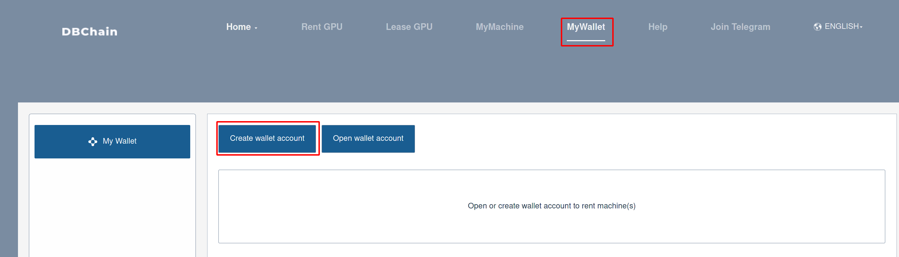
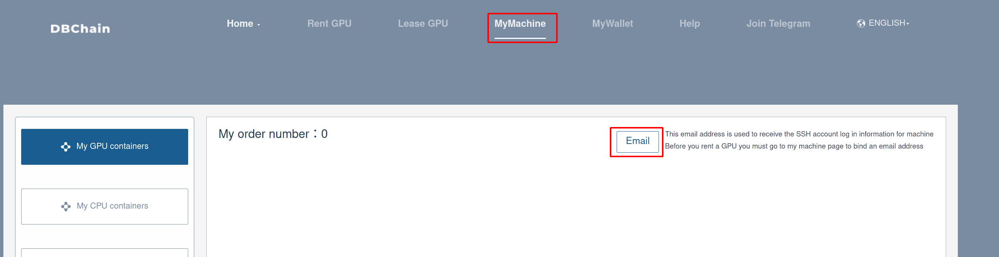
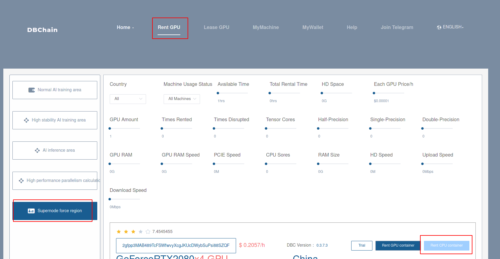
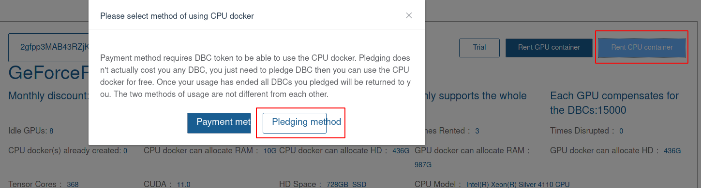
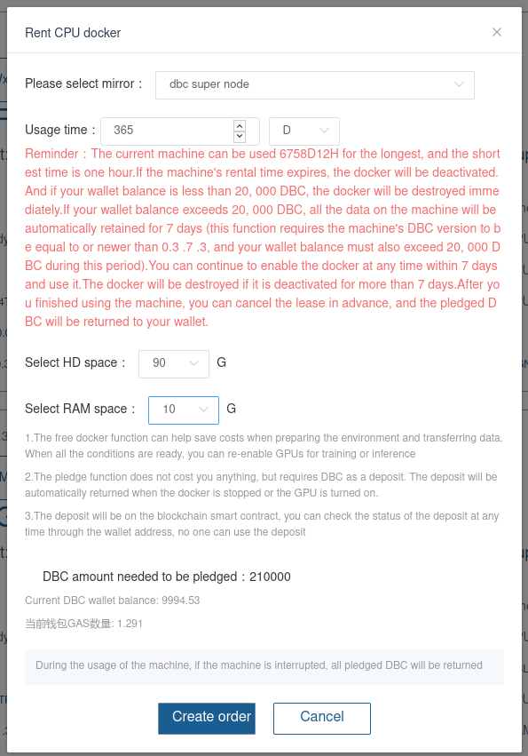

1. Open URL: [https://www.dbchain.ai](https://www.dbchain.ai)

2. Create a wallet account.

   

3. Get some GAS

   Option 1: Click "MyWallet" button, you will see "How to buy DBC". Click to buy some DBC and you will get a certain amount of GAS for free.

   Option 2: Send an email to [service@deepbrainchain.org](service@deepbrainchain.org). Write your wallet address in the body of the email and indicate your purpose.

   Option 3: Buy some GAS in Huobi, then transfer it to your current wallet address.

4. Bind your email with your wallet address

   There must be at least 1 DBC and 0.001 GAS when bind your email with your wallet address.

   

5. Rent a machine

   Click "Rent GPU" -> "High performance parallelism calculation area", select "All machines" in "Machine Usage Status" and then click "Rent GPU container".

   

   You can choose "Pledging method" to pay it ("Pledging method" only need to stake your DBC, and will not actually consume it).

   

   Then , you should choose your preference in the pop-ups:

   Mirror: dbc super node,

   Usage time: fill it according to your own needs, the time has nothing to do with the amount of pledged DBC.

   HD spaces: 90G or 120G

   RAM spaces: 10G

   After that, DBC needed will be shown. And if it can meet the demand, you can click "Create Order" to finished it.

   
