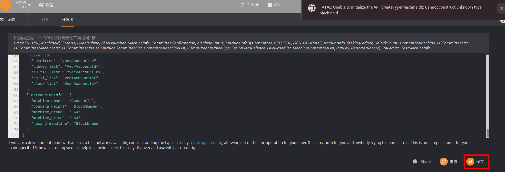
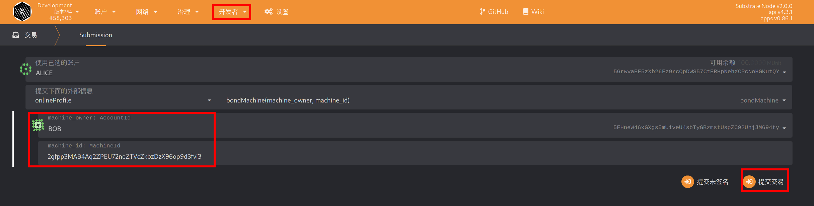
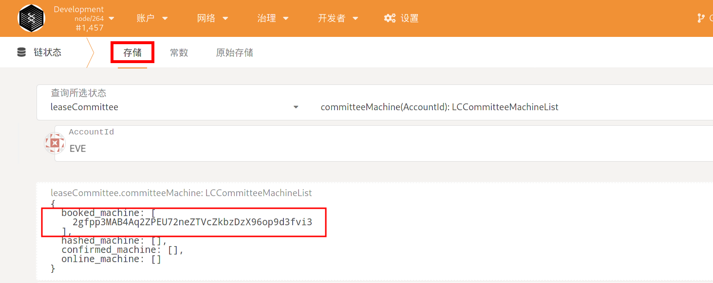
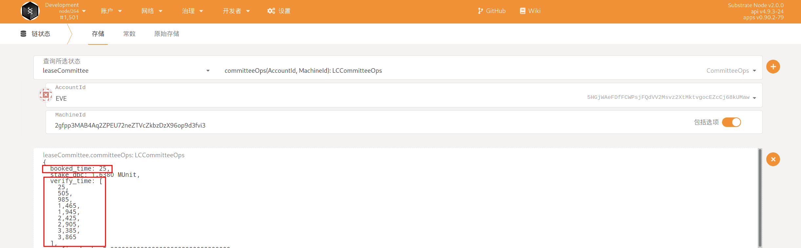
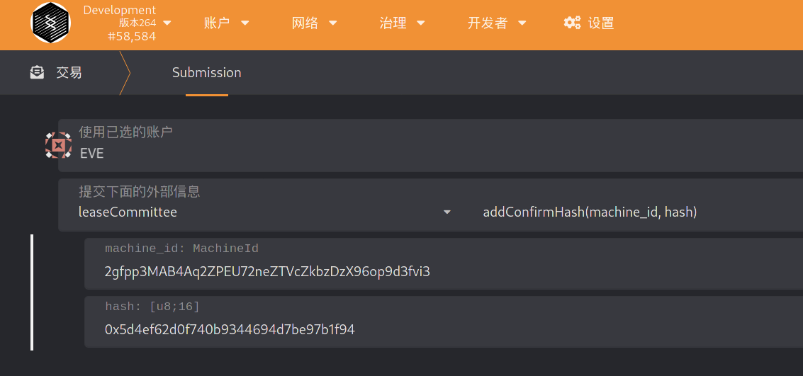
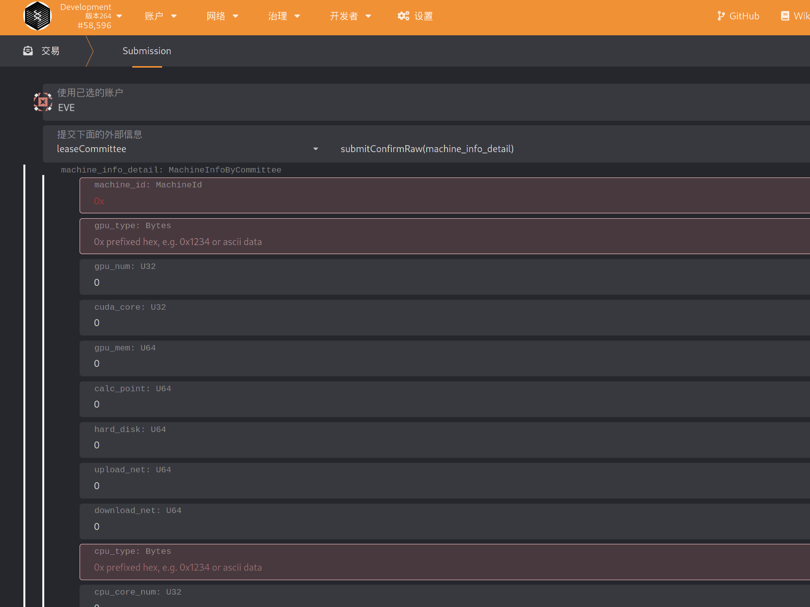

# 如何绑定机器获得在线奖励

## 方式 1: 通过网页钱包绑定

0. 绑定之前，请确保钱包中有足够的余额。（每张卡按 10 万 DBC 估计）。

1. 打开网页钱包的设置页面：`https://www.dbcwallet.io/?rpc=wss%3A%2F%2Finnertest.dbcwallet.io#/settings/developer`

2. 打开`https://github.com/DeepBrainChain/DeepBrainChain-MainChain/blob/feature/staking_v3.0.0_online_profile/types.json` ，复制 `types.json`的内容，并粘贴到网页钱包的设置页面，点击保存。

   

3. 刷新网页，等待一会。

4. 导航到：`开发者`--`交易`，如下图选择`onlineProfile`模块的`bondMachine`方法。其中，`machine_owner: AccountId` 这里填入机器里内置的钱包地址; `machineId`填入你想绑定的机器 ID， 最后点击提交交易。

   

## 方式 2: 通过脚本添加

```bash
git clone https://github.com/DeepBrainChain/DeepBrainChain-MainChain.git
cd DeepBrainChain-MainChain && checkout dev-example
yarn install
node sign_txs.js --port="wss://innertest.dbcwallet.io" --module onlineProfile --func bondMachine --key "sample split bamboo west visual approve brain fox arch impact relief smile" 5FHneW46xGXgs5mUiveU4sbTyGBzmstUspZC92UhjJM694ty 2gfpp3MAB4Aq2ZPEU72neZTVcZkbzDzX96op9d3fvi3
```

其中，`--key` 指定助记词，最后两个参数分别是机器中绑定的钱包地址，机器的 ID

# 委员会如何验证机器

0. 成为委员会

1. 查看系统分配给自己的订单。导航到 开发者--链状态--存储，在其中选择`leaseCommittee`模块的`committeeMachine`存储，点击右侧的`+`号，可以看到委员会的订单情况。如果所示，该委员会有一个系统分配的订单

   

2. 查看系统分配给该委员会进行验证的时间区间：导航到 开发者--链存储--存储，选择`leaseCommittee`的`committeeOps`方法，并输入自己的委员会帐号，与上一步委派的机器 ID，可以查询到类似下面的信息：

   

   其中，booked_time 表示派单时间，注意，派单之后的 36~48 小时(也就是区块高度 booked_time + 4320 ~ booked_time + 5760)之间，委员会提交原始信息。

   verify_time 表示系统分派的，委员会验证机器信息的开始时间。如图，该委员会被分派了 9 次机会来验证机器，每次持续时间为 4 个小时，也就是 480 个块高。此时，委员会可以挑选自己方便的时间，通过前端查询该机器的登录信息，登录到系统中验证机器。

3. 委员会计算获得机器信息的 hash

   我们已经提供了脚本来计算需要填写的信息的 Hash：

   `https://github.com/DeepBrainChain/DeepBrainChain-MainChain/blob/feature/staking_v3.0.0_online_profile/scripts/hash_str.py`

   当获取到要求的信息后，修改该脚本，并执行，得到 hash 值。**请保存好所填写的信息，直到该机器上线成功，或者上线失败**

4. 委员会提交机器信息的 Hash。如图，在 36 小时之前提交机器信息的 Hash

   

5. 委员会提交机器的原始信息。**请确保提交机器原始信息时，在派单之后的 36~48 小时之间！**

   
