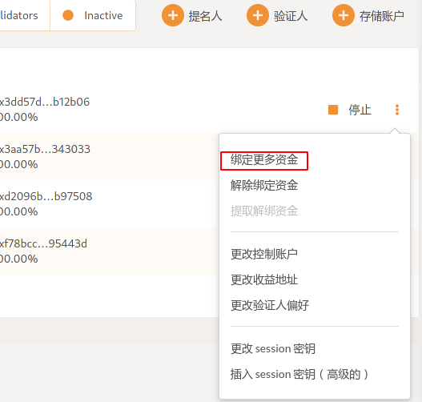
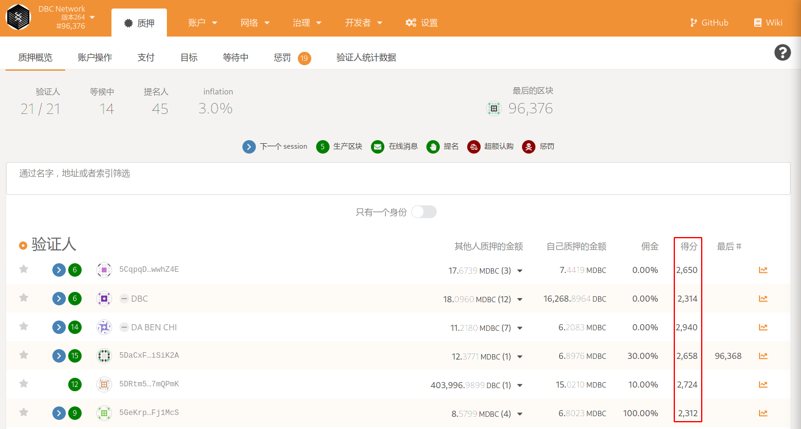
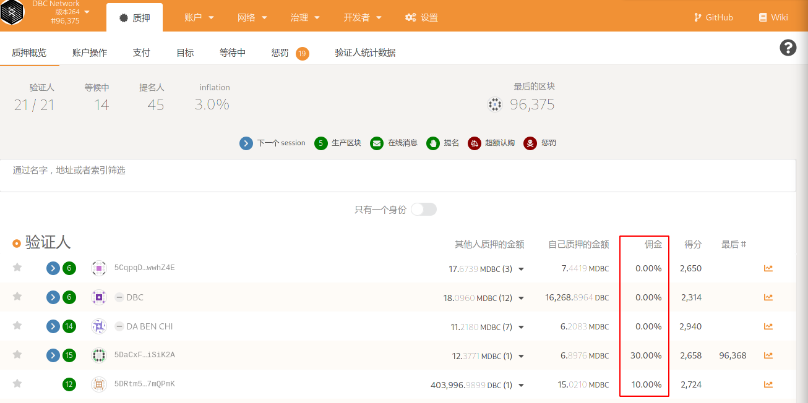
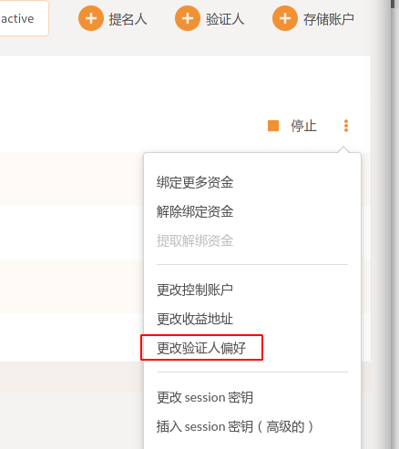

### 出块节点如何绑定更多资金

在 [https://test.dbcwallet.io/#/staking/actions](https://test.dbcwallet.io/#/staking/actions) 页面的账户列表中，点击账户右侧三个点，然后点击“绑定更多资金”即可。



### 出块得分是什么意思



一个GPU计算节点点的计算基于两个指标：GPU Cuda Core的数量和视频内存大小，GPU Cuda Core的数量占80％，视频内存占20％。

#### 后续问题。点数如何帮助确定要购买的GPU？

Nvidia的2080ti模型图形卡是参考标准，以下是用于计算各种模型图形GPU的计算节点点数的公式。
 
```
  2080ti 计算节点点: 4352=4352\*80%+4352\*11/11\*20%
   
  3070 计算节点点: 5302=5608\*80%+5608\*8/11\*20%
   
  3070Ti 8G 内存版本计算节点点数: 5734=6144\*80%+6144\*8/11\*20%
   
  3070Ti 16G 内存版本计算节点点数: 6703=6144\*80%+6144\*16/11\*20%
   
  3080 计算节点点: 8546=8704\*80%+8704\*10/11\*20%
   
  3080Ti 计算节点点: 10426=10240\*80%+10240\*12/11\*20%
   
  3090 计算节点点: 12977=10496\*80%+10496\*24/11\*20%.
```

目前，建议使用3080ti显卡，可以快速租用并获得更高的回报。

### 佣金是什么意思



在质押概览中，我们可以看到节点有佣金百分比的参数。

举例说明：如果佣金设置10%，表示出块节点首先获得10%的节点总奖励；剩下90%的节点奖励，根据所有质押在该节点的金额（包括验证人节点），按比例分。

### 出块节点如何更改佣金比例

在[https://test.dbcwallet.io/#/staking/actions](https://test.dbcwallet.io/#/staking/actions) 账户列表中，点击右侧三个点，然后点击“更改收益人偏好”即可。



