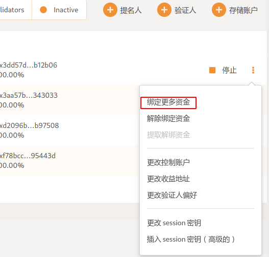
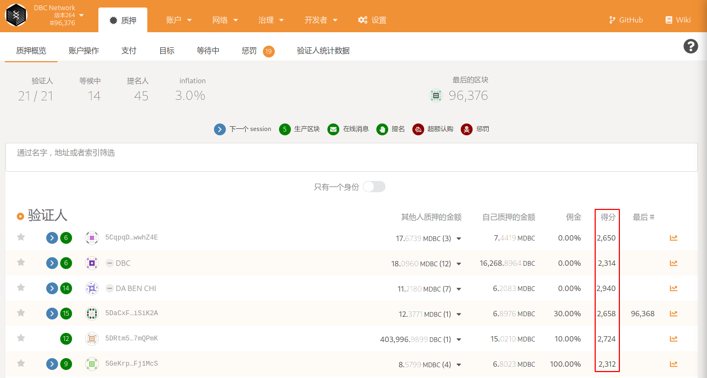
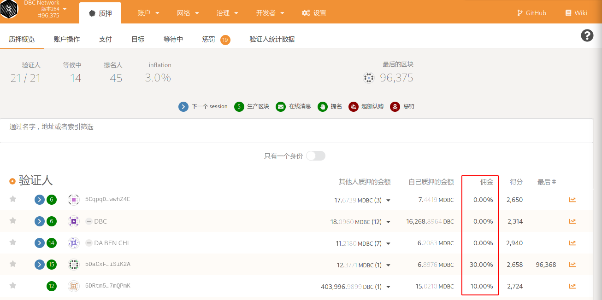
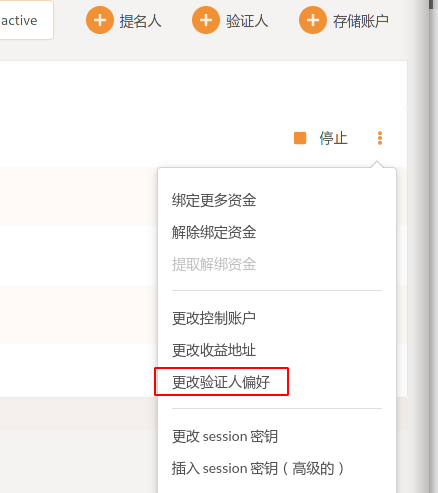

### 出块节点如何绑定更多资金

在 [https://test.dbcwallet.io/#/staking/actions](https://test.dbcwallet.io/#/staking/actions) 页面的账户列表中，点击账户右侧三个点，然后点击“绑定更多资金”即可。

### 出块得分是什么意思

### 佣金是什么意思

在质押概览中，我们可以看到节点有佣金百分比的参数。

举例说明：如果佣金设置10%，表示出块节点首先获得10%的节点总奖励；剩下90%的节点奖励，根据所有质押在该节点的金额（包括验证人节点），按比例分。

### 出块节点如何更改佣金比例

在[https://test.dbcwallet.io/#/staking/actions](https://test.dbcwallet.io/#/staking/actions) 账户列表中，点击右侧三个点，然后点击“更改收益人偏好”即可。

