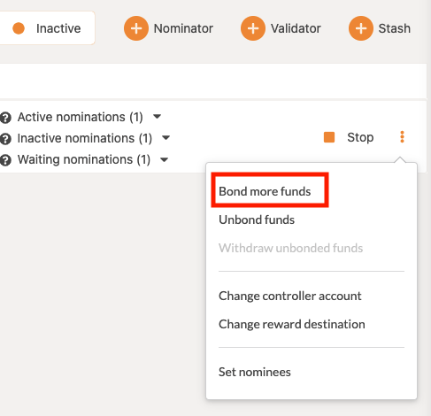
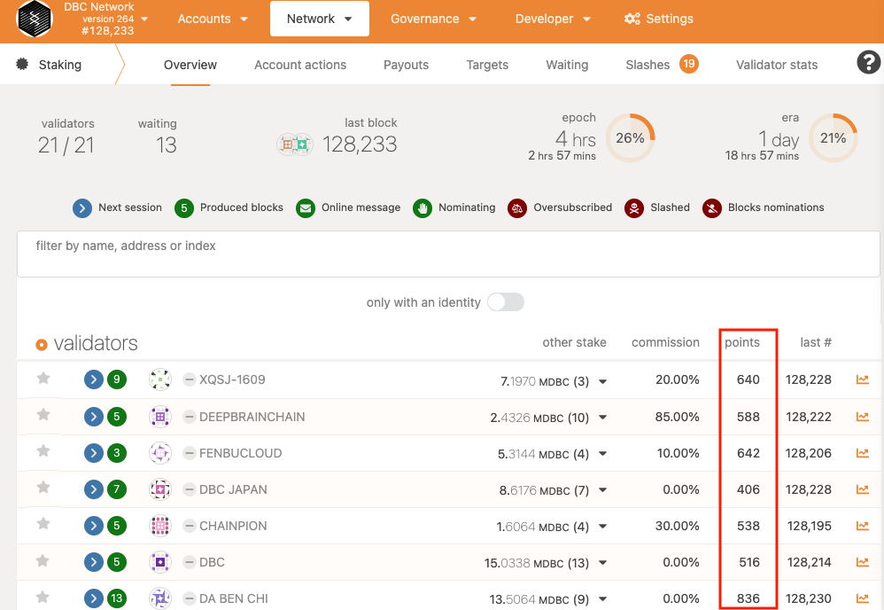
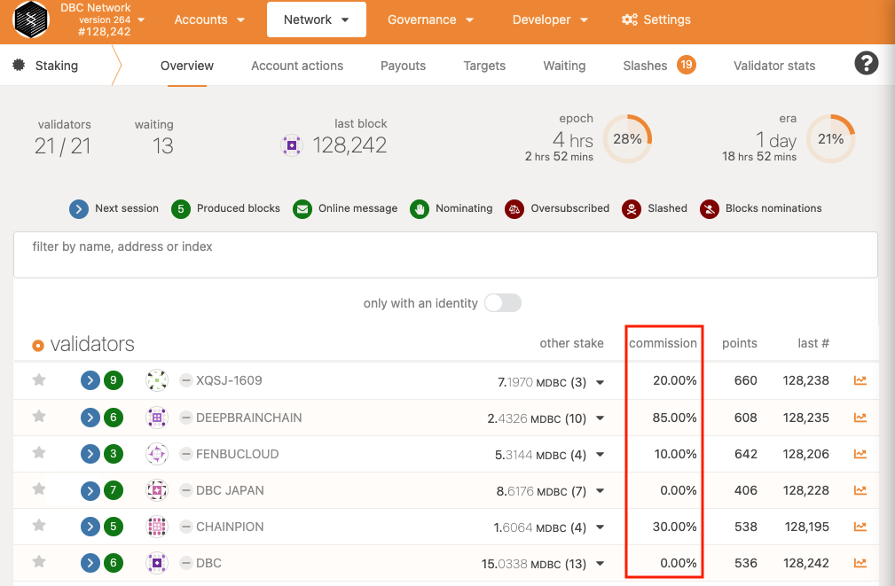
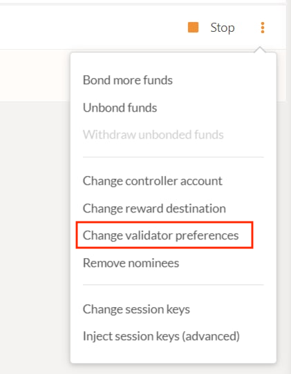

### How to bind more funds to block producers?

In the [account list (Network > Account actions)](https://test.dbcwallet.io/#/staking/actions) on the page, click the three dots on the right side of the account, and then click "Bind More Funds".



### What does the block score (points) mean?



A single GPU computing nodes points is calculated based on two indicators: the number of GPU Cuda Core and video memory size, the number of GPU Cuda Core accounts for 80%, the video memory accounts for 20%.

#### Followup question. How can points help determine what GPU to buy?

Nvidia's 2080ti model graphics card is the reference standard, the following is the formula for calculating the number of computing nodes points for various models of graphics GPUs.
 
```
  2080ti computing nodes points: 4352=4352\*80%+4352\*11/11\*20%
   
  3070 computing nodes points: 5302=5608\*80%+5608\*8/11\*20%
   
  3070Ti 8G memory version computing nodes points: 5734=6144\*80%+6144\*8/11\*20%
   
  3070Ti 16G memory version computing nodes points: 6703=6144\*80%+6144\*16/11\*20%
   
  3080 computing nodes points: 8546=8704\*80%+8704\*10/11\*20%
   
  3080Ti computing nodes points: 10426=10240\*80%+10240\*12/11\*20%
   
  3090 computing nodes points: 12977=10496\*80%+10496\*24/11\*20%.
```

At present, it is recommended to use 3080ti graphics card, you can quickly rent and get higher returns.

### What does commission mean?



In the pledge overview, we can see that the node has a commission percentage parameter.

For example: if the commission is set to 10%, it means that the block producer first gets 10% of the total node reward; the remaining 90% of the node reward is divided proportionally according to all the amount pledged on the node (including the validator node).

### How does the block producer change the commission ratio?

In the [account list (Network > Account actions)](https://test.dbcwallet.io/#/staking/actions), click the three dots on the right, and then click `Change validator preferences`.


