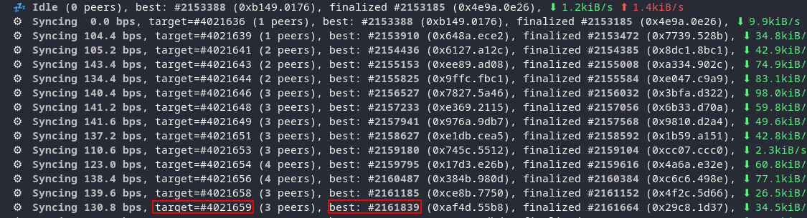

如何使用DBC vm，简单的运行验证人节点？

1. 生成一个账户：

   ```
   subkey generate --scheme sr25519
   ```

   

   ```shell
   cd ~/dbc_chain
   ```

2. 开始同步区块链数据

   ```shell
   ./substrate \
   --base-path ./db_data \
   --pruning=archive \
   --bootnodes /ip4/111.44.254.180/tcp/30333/p2p/12D3KooWNJRVErXu6PvFcfCCQZFBAp6oU7BPEz5vWQZrLoift6TG
   ```

   你将会看到这样的信息：

   

   当同步即将完成时，输入`Contrl + C` 关闭同步程序。

3. 以验证人的方式运行节点

   ```shell
   nohup ./substrate \
   --base-path ./db_data \
   --validator \
   --name YourNodeName \
   --bootnodes /ip4/111.44.254.180/tcp/30333/p2p/12D3KooWNJRVErXu6PvFcfCCQZFBAp6oU7BPEz5vWQZrLoift6TG 1>dbc_chain.log 2>&1 &
   ```

   **注意**：需要把YourNodeName替换成你喜欢的名字。别人将在网络中看到它。

4. 生成`rotateKey`

   ```bash
   curl -H "Content-Type: application/json" -d '{"id":1, "jsonrpc":"2.0", "method": "author_rotateKeys", "params":[]}' http://localhost:9933
   ```

   你将看到类似这样的输出：

   ```json
   {"jsonrpc":"2.0","result":"0x058c9370e9ded88021c44b737fe6e5ad2187663d35bf18062bf8091c4d01e8810037198cc9d312815205c141f1b4ba1d7eee22619f87b1bd870e7126501d6674fdae0864abf95678b65075734c7d46f452d51797d97c59cdcd949523d22590f83e744b083ceafbd9afe8a52659d7f1af9e41a105a07d169375deec986d64a47c","id":1}
   ```

   复制`result`后引号内的内容。

5. 将您生成的SessionKey与您的账户绑定

   在浏览器中打开...

6. 参加验证人选举

7. 领取节点奖励


