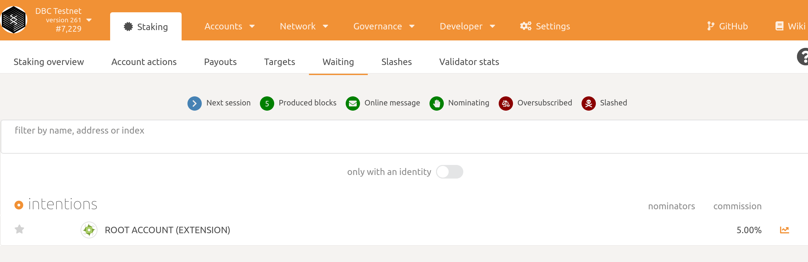

# 如何加入DBC验证节点？

1. 编译

   ```bash
   # 安装依赖，rust，subkey
   curl https://getsubstrate.io -sSf | bash
   source ~/.cargo/env
   
   # 编译dbc-chain
   git clone https://github.com/DeepBrainChain/DeepBrainChain-MainChain.git
   cd DeepBrainChain-MainChain && git checkout dbc-dev2
   cargo build --release
   ```

2. 生成Session Key

   ```bash
   # 生成stash账户 (用于存储现金)
   subkey generate --scheme sr25519
   # 以下为生成的内容：
   Secret phrase `success extra health pupil cactus find better cat layer boss renew room` is account:
     Secret seed:      0x91c96acae5f3b79682ea1db1b94f81fa1915bd2981b345b9a90f8b64786d8ffe
     Public key (hex): 0x22150e8093537cee480256fcaa2e9a2883bfea41226ecbfd168c980f42f69135
     Account ID:       0x22150e8093537cee480256fcaa2e9a2883bfea41226ecbfd168c980f42f69135
     SS58 Address:     5CqPjts5GYvR1XhwFLnFZAph4k76m3qatSAXCt1AwkFUiM6B
   
   # 生成session账户
   # 生成Babe账户 （用于出块）
   subkey generate --scheme sr25519
   # 以下为生成的内容：
   Secret phrase `bonus filter major permit left dish person miss vacant wear agree venture` is account:
     Secret seed:      0x352f589d4e80d1240d2c5ca1926810b8ea8ec37265d1be6780c3c7cdf08826a7
     Public key (hex): 0x627693dad594e3d6aa2794ed54cf096c443745a59c84ed68a96a9c9e0e043016
     Account ID:       0x627693dad594e3d6aa2794ed54cf096c443745a59c84ed68a96a9c9e0e043016
     SS58 Address:     5EHomtXRcVA5b4jaqvQPnFGrg13djvyAHQC5hBL7Pigzv2TN
   
   # 用上一步生成的`Secret phase`，生成Grandpa账户 （用于区块 finalized）
   subkey inspect --scheme ed25519 "bonus filter major permit left dish person miss vacant wear agree venture"
   # 以下为生成的内容：
   Secret phrase `bonus filter major permit left dish person miss vacant wear agree venture` is account:
     Secret seed:      0x352f589d4e80d1240d2c5ca1926810b8ea8ec37265d1be6780c3c7cdf08826a7
     Public key (hex): 0xef5e8674d8c365c30ea0b702594dd8337f0c83917245d966bfc36b13e88285e4
     Account ID:       0xef5e8674d8c365c30ea0b702594dd8337f0c83917245d966bfc36b13e88285e4
     SS58 Address:     5HUZP5VBNJCW7wUnGyBbBykdTdshDCpfRZRv3TeEorwtLb9r
   
   ```

   **请记下生成的内容，请勿使用上面的账户。**

   ***TODO：获取一定量的`DBC` token ，以保证你的`stash账户`有一定量的DBC***

   ***TODO: 生成controller账户，并与stash账户进行绑定***

   为了账户的安全，您也可以生成一个账户(`Controller账户`)用于控制资金账户(`Stash账户`)。如果您想要这么做，再生成一个sr25519的账户作为Controller账户，并在bond 操作的时候，将controller账户设置为您的controller账户。

3. 运行同步节点

   ```bash
   ./target/release/substrate \
   	--base-path ./account5 \
   	--chain ./dbcSpecRaw.json \
   	--pruning=archive \
   	--port 30333 \
   	--ws-port 9944 \
   	--rpc-port 9933 \
   	--rpc-cors=all \
   	--bootnodes /ip4/111.44.254.180/tcp/30333/p2p/12D3KooWNJRVErXu6PvFcfCCQZFBAp6oU7BPEz5vWQZrLoift6TG
   ```

   查看同步状态：你可以通过：https://telemetry.polkadot.io/#list/DBC%20Testnet 查看当前区块块高，通过与已同步的块高比较，判断同步是否完成。

   **参数说明：**

   `--base-path`：指定该区块链存储数据的目录。如果不指定，将使用默认路径。如果目录不存在，将会为你自动创建。如果该目录已经有了区块链数据，将会报错，这时应该选择不同的目录或清除该目录内容

   `--chain ./dbcSpecRaw.json`：指定以该配置文件启动区块链。

   `--pruning=archive`：以归档的方式启动区块链

   `--port`：指定你的p2p监听端口。`30333` 是默认端口，如果你想使用默认端口可以省略该参数。

   `--ws-port`：指定WebSocket监听的端口。默认值是`9944`.

   `--rpc-port`：指定节点监听RPC通信的端口。`9933`是默认值，这个参数可以省略。

   `--rpc-cores`：指定哪些请求来源的地址能够访问该节点。值可以是逗号分割的地址(protocol://domain 或一个`null`值)，all表示禁用请求来源检查。

   `--bootnodes`：指定引导节点地址

1. 在同步节点数据完成之后，关闭程序。然后以验证人的方式运行节点：

   ```bash
   ./target/release/substrate \
   	--base-path ./account5 \
   	--chain ./dbcSpecRaw.json \
   	--validator \
   	--name MyNode5 \
   	--port 30333 \
   	--ws-port 9944 \
   	--rpc-port 9933 \
   	--rpc-cors=all \
   	--bootnodes /ip4/111.44.254.180/tcp/30333/p2p/12D3KooWNJRVErXu6PvFcfCCQZFBAp6oU7BPEz5vWQZrLoift6TG
   ```

2. 将 https://polkadot.js.org/apps 切换到你本地的区块

   点击左上角图表，在弹出的下面输入自定义终端`ws://127.0.0.1:9944`，然后点击上面的转换按钮

   

3. 登陆你的`stash账户`（通过`polkadot`浏览器插件），你将能看到你的余额：

   

   

   导航到`Staking > Account actions`，点击`stash`

   设置bond的金额（确保除了bond的数额，您的账户中还有余额以用来发送交易）：

   


7. 生成`rotateKey`: 

   在`Polkadot UI` 中导航到`Toolbox > RPC Calls`，然后选择`author > rotateKeys()` 选项，点击`Submit RPC call`，这样会生成`rotatekeys`， 记录生成的值。

   

   另外，可以使用CLI生成该值：

   ```bash
   curl -H "Content-Type: application/json" -d '{"id":1, "jsonrpc":"2.0", "method": "author_rotateKeys", "params":[]}' http://localhost:9933
   ```

   设置`rotateKey`： 在执行了bond之后，您将能够在Polkadot上看到`Session Key`的按钮

   

   点击它，并将`rotateKeys`填入。

   

   现在，你可以到 `Telemetry` 看到你的节点了！

   

8. 设置`Validate`

   完成了第6步之后，你应该能在Polkadot UI上看到`Validate` 按钮，点击它。这里，你将会需要设置 `Payment Preferences`

   

   `payment preferences`: 这个参数是你设置的，付给你的奖励的比例。剩下的奖励，将会按照stake的数量，按比例分给质押dbc的人。

   `automatic unstake threshold`- 设置被发现多少次离线后，取消验证人资格。

9. 设置参加验证人选举

   完成了上述步骤后，你将能看到`Validate`的按钮。点击`Validate` 按钮，
   
   
   
   这时你将需要设置验证人偏好。
   
   
   
   在 `reward commission percentage`栏目中，你将需要输入你作为验证人的收益偏好。然后点击右下角`Validate`，并发送交易。
   
   这时，在`Waiting`界面，你将能看到你的账户正在等待下个`Era`，来参加选举成为验证人节点。
   
   
   
   

## 如何领取节点奖励？

在浏览器插件polkadot中登陆你的stash账户，在 `Staking > Payouts` 中，你将能看到待领取的奖励：


点击右下角的Payout，发送交易即可。


