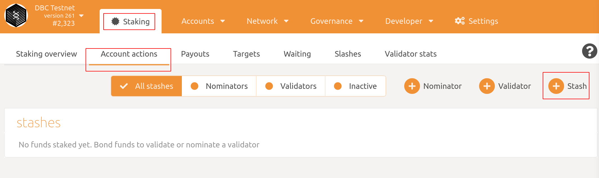
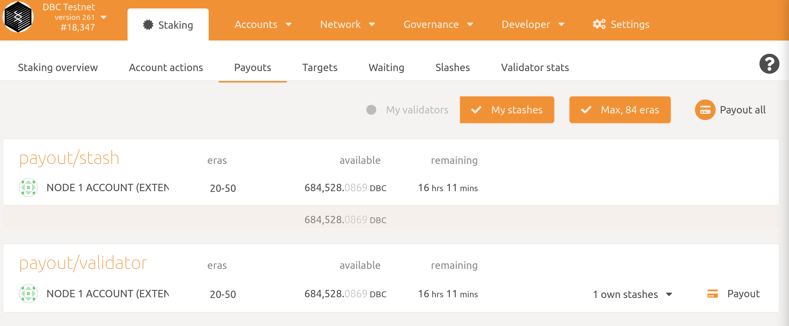

# 如何加入DBC验证节点？

1. 编译DBC chain

   + **方式1**: 使用预编译版本：

     ```bash
     wget https://github.com/DeepBrainChain/DeepBrainChain-MainChain/releases/download/v0.1/dbc_chain_ubuntu16.04.tar.gz
     tar xf dbc_chain_ubuntu16.04.tar.gz
     cd dbc_chain
     ```

   + ~~**方式1**：使用预编译版本。如果您是使用 DBC vm 运行超级节点，登录您的服务器，切换到编译好的目录即可。~~

     ~~cd /root/dbc_chain~~

   + **方式2**：从源码进行编译

     ```bash
     # 安装依赖，rust，subkey
     curl https://getsubstrate.io -sSf | bash -s -- --fast
     source ~/.cargo/env
     cargo install --force subkey --git https://github.com/paritytech/substrate --version 2.0.0 --locked
     
     # 编译dbc-chain
     git clone https://github.com/DeepBrainChain/DeepBrainChain-MainChain.git
     cd DeepBrainChain-MainChain
     cargo build --release
     ```
   
2. 生成资金账户

   + **[可选步骤]：当您已有资金账户时，可以略过这一步**

     ```bash
     # 生成stash账户 (用于存储现金)
     subkey generate --scheme sr25519
     
     # 以下为生成的内容：
     Secret phrase `success extra health pupil cactus find better cat layer boss renew room` is account:
       Secret seed:      0x91c96acae5f3b79682ea1db1b94f81fa1915bd2981b345b9a90f8b64786d8ffe
       Public key (hex): 0x22150e8093537cee480256fcaa2e9a2883bfea41226ecbfd168c980f42f69135
       Account ID:       0x22150e8093537cee480256fcaa2e9a2883bfea41226ecbfd168c980f42f69135
       SS58 Address:     5CqPjts5GYvR1XhwFLnFZAph4k76m3qatSAXCt1AwkFUiM6B
     ```

     > **请保存生成的内容，请勿使用上面的账户。**
     >
     > ***TODO：获取一定量的`DBC` token ，以保证你的`stash账户`有一定量的DBC***

   + **[可选步骤]** 生成控制账户（controller account），并与stash账户进行绑定

     为了账户的安全，您也可以生成一个账户(`Controller账户`)用于控制资金账户(`Stash账户`)。如果您想要这么做，再生成一个sr25519的账户作为Controller账户。在后面进行bond 操作的时候，将controller账户设置为您的controller账户。

3. 运行同步节点

   ```bash
   ./dbc-chain --base-path ./db_data --chain ./dbcSpecRaw.json --pruning archive --bootnodes /ip4/111.44.254.180/tcp/30333/p2p/12D3KooWPz25eMDbYgxzWqExmipKCngMdgijy6rw4jdDGke6BShY
   ```

   + 如果你是从源码进行编译，可执行文件路径为：`./target/release/dbc-chain`

   同步完成后，`Control + C`关掉程序。你可以根据`target`与`best`的比较来判断是否同步已经完成。当target与best相差不大（如100以内）时，可以认为已经完成同步。

   

   **参数说明：**

   `--base-path`：指定该区块链存储数据的目录。如果不指定，将使用默认路径。如果目录不存在，将会为你自动创建。如果该目录已经有了区块链数据，将会报错，这时应该选择不同的目录或清除该目录内容

   `--pruning=archive`：以归档的方式启动区块链

   `--bootnodes`：指定引导节点地址。

4. 在第3步同步节点数据完成之后，关闭同步命令。然后以验证人的方式运行节点：

   ```bash
   nohup ./dbc-chain --base-path ./db_data --chain ./dbcSpecRaw.json --validator --name YourNodeName --bootnodes /ip4/111.44.254.180/tcp/30333/p2p/12D3KooWPz25eMDbYgxzWqExmipKCngMdgijy6rw4jdDGke6BShY 1>dbc_node.log 2>&1 &
   ```

   + 如果你是从源码进行编译，可执行文件路径为：`./target/release/dbc-chain`

   注意：这里 **`--name` 是设置你节点的名称**，你可以为你的节点起一个独一无二容易辨认的名称，别人将能在网络上看到它。

5. 生成`rotateKey`

   在运行验证人节点命令的机器上运行下面命令

   ```bash
   curl -H "Content-Type: application/json" -d '{"id":1, "jsonrpc":"2.0", "method": "author_rotateKeys", "params":[]}' http://localhost:9933
   ```

6. 登陆你的`资金账户`，设置bond金额

   + 安装`polkadot{.js}`浏览器插件
     + Chrome 安装链接：[Chrome web store](https://chrome.google.com/webstore/detail/polkadot{js}-extension/mopnmbcafieddcagagdcbnhejhlodfdd)
     + Firefox 安装链接：[Firefox add-ons](https://addons.mozilla.org/en-US/firefox/addon/polkadot-js-extension/)

   + 通过`polkadot{.js}`浏览器插件, 导入第二步的`Secret phrase`

     

   + 打开[https://test.dbcwallet.io/#/accounts](https://test.dbcwallet.io/#/accounts)  你将能看到你的余额：

     

   

   ​	导航到`Staking > Account actions`，点击`stash`	

   设置bond的金额（确保除了bond的数额，您的账户中还有余额以用来发送交易）：

   

   **说明：**

   + `Stash account`：你的资金账户，这里我们bond 45 DBC，确保账户中余额至少有这么多

   + `controller account`：这个账户也应该有少量的DBC来发送开始和停止验证人的交易

   + `value bonded`：你想要bond/stake多少DBC, 请注意，你不需要bond账户中所有的余额，另外你随后可以增加bond的数额。

   + `payment destination`：验证人获得的奖励将会被发给这个账户。这个账户可以设置成任何账户。


7. 设置`rotateKey`:

   在执行了bond之后，您将能够在Polkadot上看到`Session Key`的按钮：

   

   点击它，并将步骤5生成的`rotateKeys`填入。

   

   现在，你可以到 [Telemetry]( https://telemetry.polkadot.io/#list/DBC%20Network)看到你的节点了！

   

9. 设置参加验证人选举

   完成了上述步骤后，你将能看到`Validate`的按钮。点击`Validate` 按钮，
   
   
   
   这时你将需要设置验证人偏好：
   
   
   
   在 `reward commission percentage`栏目中，你将需要输入你作为验证人的收益偏好。然后点击右下角`Validate`，并发送交易。
   
   这时，在`Waiting`界面，你将能看到你的账户正在等待下个`Era`，来参加选举成为验证人节点。
   
   
   
   

## 如何领取节点奖励？

在浏览器插件polkadot中登陆你的stash账户，在 `Staking > Payouts` 中，你将能看到待领取的奖励：



点击右下角的Payout，发送交易即可。
