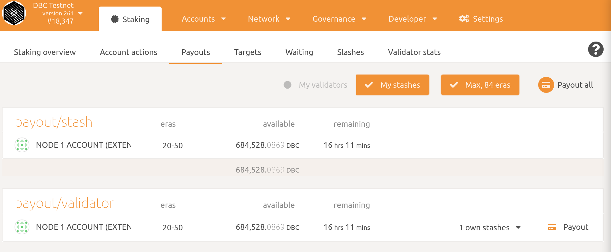

# How to run a DBC validator?

1. Compile DBC chain

   + Option 1: use pre-build version. If you are running DBC vm to run an validator, login your server,  change dir to `/root/dbc_chain`  you will find pre-build binary.

     ```bash
     cd /root/dbc_chain
     ```

   + Option 2: compile from source

     ```bash
     # install rust，subkey
     curl https://getsubstrate.io -sSf | bash -s -- --fast
     source ~/.cargo/env
     cargo install --force subkey --git https://github.com/paritytech/substrate --version 2.0.0 --locked
     
     # compile dbc-chain
     git clone https://github.com/DeepBrainChain/DeepBrainChain-MainChain.git
     cd DeepBrainChain-MainChain
     cargo build --release
     ```

2. Generate stash account

   + **Optional step. If you already have stash account, you can skip this.**

     ```bash
     subkey generate --scheme sr25519
     
     # The following is generated：
     Secret phrase `success extra health pupil cactus find better cat layer boss renew room` is account:
       Secret seed:      0x91c96acae5f3b79682ea1db1b94f81fa1915bd2981b345b9a90f8b64786d8ffe
       Public key (hex): 0x22150e8093537cee480256fcaa2e9a2883bfea41226ecbfd168c980f42f69135
       Account ID:       0x22150e8093537cee480256fcaa2e9a2883bfea41226ecbfd168c980f42f69135
       SS58 Address:     5CqPjts5GYvR1XhwFLnFZAph4k76m3qatSAXCt1AwkFUiM6B
     ```

     > **Please record the output of the command, and don't use the account generated above**
     >
     > ***TODO：Get some `DBC` token ，ensure your`stash account` have some DBC***

   + **[Optional Step]**: Generate controller account, and bond with and bond with your stash account

     For your account security, you can also generate an account (`Controller account`) to control the `stash account`. If you want to do this, create a sr25519 account as the `Controller account`. When performing the bond operation in setp 6, use the controller account  in controller account box. 

3. Synchronize Chain Data

   ```bash
   ./dbc-chain --base-path ./db_data --chain ./dbcSpecRaw.json --pruning=archive --bootnodes /ip4/111.44.254.180/tcp/30333/p2p/12D3KooWRo9P2wsKg2cKdTN8de9BqFmLsxPhnohUdZWFLvCF5sEG
   ```
   
   + If you compile from source, the binary path is `./target/release/dbc-chain`
   
   After finished synchronize, type `Control + C` to close the above command. You can compare `target` and `best` to infer if sync is finished. When `target` is closed (100 blocks, for example) to `best` , it can be regard sync is finished.

   

   **Flags in detail：**

   `--base-path`：Specifies a directory where Substrate should store all the data  related to this chain. If this value is not specified, a default path  will be used. If the directory does not exist it will be created for  you. If other blockchain data already exists there you will get an  error. Either clear the directory or choose a different one.

   `--chain ./dbcSpecRaw.json`：Specifies which chain specification to use. 

   `--pruning=archive`：synchronize chain data

   `--bootnodes`：specified a single boot node.

4. After synchronizing block data finished, stop the synchronizing command. Then run the node as a validator: 

   ```bash
   nohup ./dbc-chain --base-path ./db_data --chain ./dbcSpecRaw.json --validator --name YourNodeName --bootnodes /ip4/111.44.254.180/tcp/30333/p2p/12D3KooWRo9P2wsKg2cKdTN8de9BqFmLsxPhnohUdZWFLvCF5sEG 1>dbc_node.log 2>&1 &
   ```
   
   + If you compile from source, the binary path is `./target/release/dbc-chain`
   
   You can give your validator any name that you like, but note that others will be able to see it, and it will be included in the list of all servers using the same telemetry server. Since numerous people are using telemetry, it is recommended that you choose something likely to be unique.
   

You may want to run this command backend, just add `nohup` before this command and `&` after this command.

5. generate`rotateKey`

   Run the following command in the terminal, and record the result.

   ```bash
   curl -H "Content-Type: application/json" -d '{"id":1, "jsonrpc":"2.0", "method": "author_rotateKeys", "params":[]}' http://localhost:9933
   ```

6. Login your`stash account` to set bond stash

   + Install `polkadot{.js}` adds-on

     + Chrome, install via [Chrome web store](https://chrome.google.com/webstore/detail/polkadot{js}-extension/mopnmbcafieddcagagdcbnhejhlodfdd)
     + Firefox, install via [Firefox add-ons](https://addons.mozilla.org/en-US/firefox/addon/polkadot-js-extension/)
   + login by`polkadot{.js}` browser adds-on by import `Secret phrase` generated in step 2.
   + open [https://test.dbcwallet.io/#/accounts](https://test.dbcwallet.io/#/accounts) you will see your balance:
   
   


​	navigate to`Staking > Account actions`，click `stash`


 You should set bond balance（Make sure not to bond all your DBC balance since you will be unable to pay transaction fees from your bonded balance.）：

   **Description：**

   + `Stash account`：Select your Stash account. In this example, we will bond 45 DBC - make sure that your Stash account contains *at least* this much. You can, of course, stake more than this.
   + `controller account`：Select the Controller account created earlier. This account will also need a small amount of DBC in order to start and stop validating.
   + `value bonded`：How much DBC from the Stash account you want to bond/stake. Note that you do not need to bond all of the DBC in that account. Also note that you can always bond *more* DBC later.
   + `payment destination`：The account where the rewards from validating are sent. 


7. Set Session Keys

   After bond your stash，you can see in Polkadot UI `Session Key`button：

   

   click it and input the result in step 5`rotateKeys`。

   

   Now, check in [Telemetry]( https://telemetry.polkadot.io/#list/DBC%20Network) and you can see your node.

9. Validate

   After steps above you can see`Validate` button and click it,
   
   
   
   you should set your preference as a validator.
   
   in  `reward commission percentage` you should input your commission preference. Then clieck `Validate` to send this transaction。
   
   Then，in `Waiting` page，you are waiting status`Era` to be a validator.
   
   
   
   

## How to get your rewards payout？

Login in your `polkadot{.js}` account，navigate to `Staking > Payouts` ，you may see the rewards to be payout：



chick `Payout` button to send a transaction.
