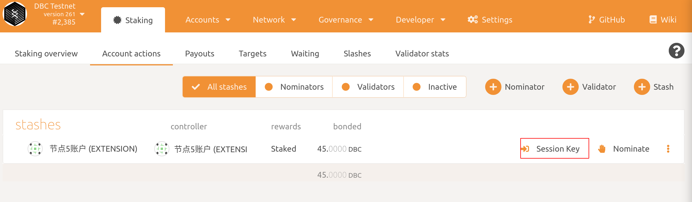

# How to run a DBC validator?

0. Recommended hardware
   + RAM：8G
   + CPU：2核
   + Disk：100G

1. Generate stash account （If you already have stash account, you can skip this）

   + Option 1: Install `polkadot{.js}` adds-on

     + Chrome, install via [Chrome web store](https://chrome.google.com/webstore/detail/polkadot{js}-extension/mopnmbcafieddcagagdcbnhejhlodfdd)
     + Firefox, install via [Firefox add-ons](https://addons.mozilla.org/en-US/firefox/addon/polkadot-js-extension/)

     Then generate by `polkadot{.js}`

   + Option 2: Generate account from [https://test.dbcwallet.io/#/accounts](https://test.dbcwallet.io/#/accounts)，click `Account` -- `Add account`

   + Option 3: Generate by command line:

     ```bash
     curl --proto '=https' --tlsv1.2 -sSf https://sh.rustup.rs | sh
     cargo install --force subkey --git https://github.com/paritytech/substrate --version 2.0.1 --locked
     ```

2. Get `dbc-chain` binary

   + Option 1: use pre-build version (ubuntu 16.04 only).

     ```
     wget https://github.com/DeepBrainChain/DeepBrainChain-MainChain/releases/download/v0.1/dbc_chain_ubuntu16.04.tar.gz
     tar xf dbc_chain_ubuntu16.04.tar.gz
     cd dbc_chain
     ```

   + Option 2: compile from source

     ```bash
     # install rust，subkey
     curl https://getsubstrate.io -sSf | bash -s -- --fast
     source ~/.cargo/env
     
     # compile dbc-chain
     git clone https://github.com/DeepBrainChain/DeepBrainChain-MainChain.git
     cd DeepBrainChain-MainChain
     cargo build --release
     ```

3. Synchronize Chain Data

   ```bash
   ./dbc-chain --base-path ./db_data --chain ./dbcSpecRaw.json --pruning=archive --bootnodes /ip4/111.44.254.180/tcp/30333/p2p/12D3KooWNa5XXT8PXgS9aT6uKJanjbEHtP2z8vTMdKA8e1TqgRYv
   ```

   + If you compile from source, the binary path is `./target/release/dbc-chain`
+ After finished synchronize, type `Control + C` to close the above command. You can compare `target` and `best` to infer if sync is finished. When `target` is closed (100 blocks, for example) to `best` , it can be regard sync is finished.
   + **Flags in detail：**
  + `--base-path`：Specifies a directory where Substrate should store all the data  related to this chain. If this value is not specified, a default path  will be used. If the directory does not exist it will be created for  you. If other blockchain data already exists there you will get an  error. Either clear the directory or choose a different one.
     + `--chain ./dbcSpecRaw.json`：Specifies which chain specification to use. 
     + `--pruning=archive`：synchronize chain data
     + `--bootnodes`：specified a single boot node.
4. After synchronizing block data finished, stop the synchronizing command. Then run the node as a validator: 

   ```bash
   nohup ./dbc-chain --base-path ./db_data --chain ./dbcSpecRaw.json --validator --name YourNodeName --bootnodes /ip4/111.44.254.180/tcp/30333/p2p/12D3KooWNa5XXT8PXgS9aT6uKJanjbEHtP2z8vTMdKA8e1TqgRYv 1>dbc_node.log 2>&1 &
   ```

   + If you compile from source, the binary path is `./target/release/dbc-chain`
   + You can give your validator any name that you like, but note that others will be able to see it, and it will be included in the list of all servers using the same telemetry server. Since numerous people are using telemetry, it is recommended that you choose something likely to be unique.
5. generate`rotateKey`

   Run the following command in the terminal, and record the result.

   ```bash
   curl -H "Content-Type: application/json" -d '{"id":1, "jsonrpc":"2.0", "method": "author_rotateKeys", "params":[]}' http://localhost:9933
   ```

6. Bond stash

   + open [https://test.dbcwallet.io/#/accounts](https://test.dbcwallet.io/#/accounts) you will see your balance: 

   + navigate to`Staking > Account actions`，click `stash`

   + You should set bond balance（Make sure not to bond all your DBC balance since you will be unable to pay transaction fees from your bonded balance.）：

   **Description：**

   + `Stash account`：Select your Stash account. In this example, we will bond 45 DBC - make sure that your Stash account contains *at least* this much. You can, of course, stake more than this.
   + `controller account`：Select the Controller account created earlier. This account will also need a small amount of DBC in order to start and stop validating.
   + `value bonded`：How much DBC from the Stash account you want to bond/stake. Note that you do not need to bond all of the DBC in that account. Also note that you can always bond *more* DBC later.
   + `payment destination`：The account where the rewards from validating are sent. 


7. Set Session Keys

   + After bond your stash，you can see in Polkadot UI `Session Key`button：

   + click it and input the result in step 5`rotateKeys`

   + Now, check in [Telemetry]( https://telemetry.polkadot.io/#list/DBC%20Network) and you can see your node.

8. Validate

   + After steps above you can see`Validate` button and click it,
   
   + You should set your preference as a validator.
   
   + In  `reward commission percentage` you should input your commission preference. Then clieck `Validate` to send this transaction。Then，in `Waiting` page，you are waiting status`Era` to be a validator.
   
   

## How to get your rewards payout？

Navigate to `Staking > Payouts > Max, 84 eras` ，you may see all the rewards to be payout：


chick `Payout all` button to send a transaction.