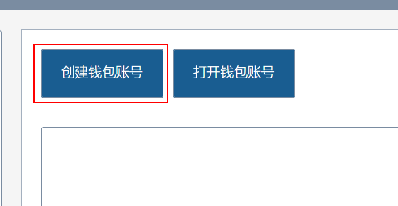
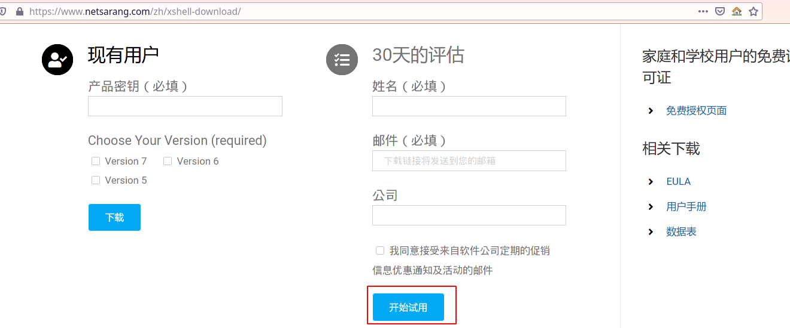

## 如何租用一台服务器?

### 创建帐号

打开`dbchain`网站：[https://www.dbchain.ai/mywallet/myWallet](https://www.dbchain.ai/mywallet/myWallet)，点击创建钱包帐号：

然后输入您的密码，并点击创建：

随后，点击“下载加密后的私钥”，**保存您的私钥文件**。然后点击“继续”，保存私钥并点击完成。

在完成了帐号创建之后，您将进入到下面的界面：

点击 "如何购买 DBC" 和“怎样获取 GAS” 来选择您喜欢的方式获取一些 DBC 用以质押 和一些 GAS 用以支付交易费用。

当您获取了 DBC 和 GAS 之后，需要绑定邮箱地址才能进行机器租用：点击“我的机器”，然后点击“绑定邮箱”

然后，输入你的邮箱地址，点击”收邮件“，并输入邮件中的 DBC 数量，点击绑定即可。

### 租用服务器

打开租用 GPU 页面：[https://www.dbchain.ai/gpu/list](https://www.dbchain.ai/gpu/list)，点击”租用 CPU 容器“，并选择质押方式。

然后，输入您想租用的服务器环境，使用时长等参数，并生成订单。

您将会收到一封邮件，提示您登录服务器所需要的信息。您也可以参考下面的方式，进行登录服务器。

## 登录 Linux 服务器

1. windows 系统中，您可以可以使用`xshell`或您喜欢的其他软件登录到服务器。在浏览器中打开 xshell 的[下载页面](https://www.netsarang.com/zh/xshell-download/)，输入邮箱进行试用，随后根据邮件链接进行下载。

   

2. 通过 Xshell 与服务器建立连接。安装好 Xshell 后，运行，点击菜单栏中的“文件”-->“新建”，打开新建会话窗口，左侧菜单栏点击“连接”，在右侧中填入会话名称及主机 ip 地址（服务器的 IP 地址），点击“确定”，建立一个新连接。

3. 登录服务器。单击左上角的“文件”菜单，在其下拉选项选择“打开”命令，弹出会话对话框，左下角有一个选项“启动时显示此对话框”，这个选项的意思是：每次打开 Xshell 都直接跳出这个对话框，根据需求勾选，然后找到你想登录的服务器，点击“连接”即可。

   
