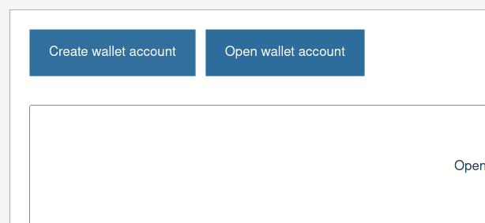
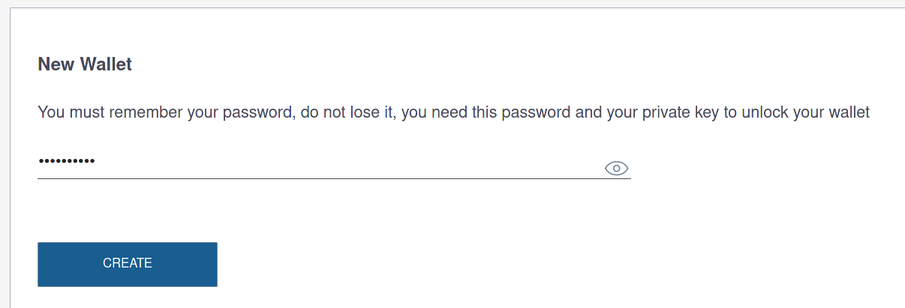
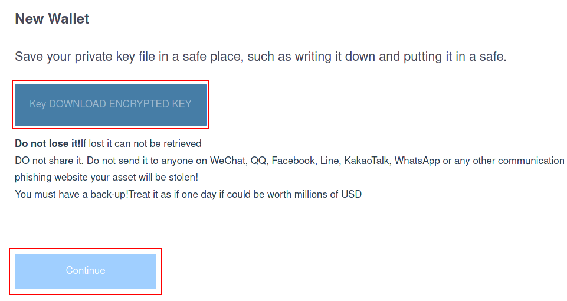
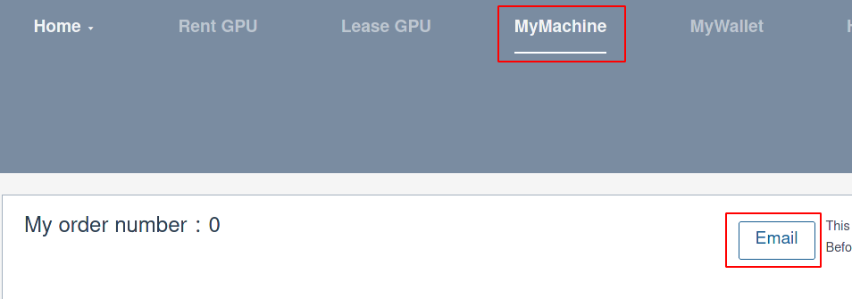
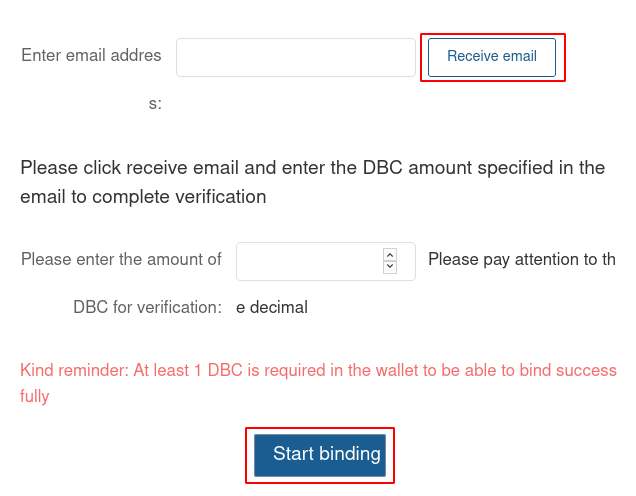
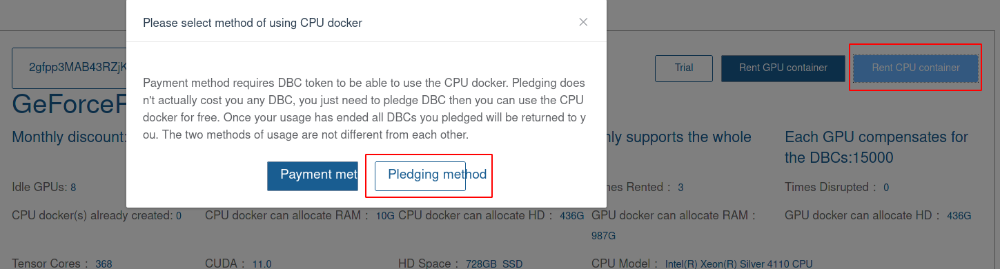
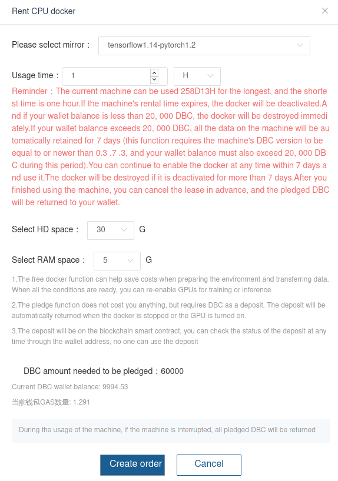
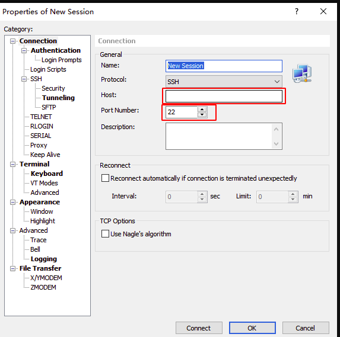
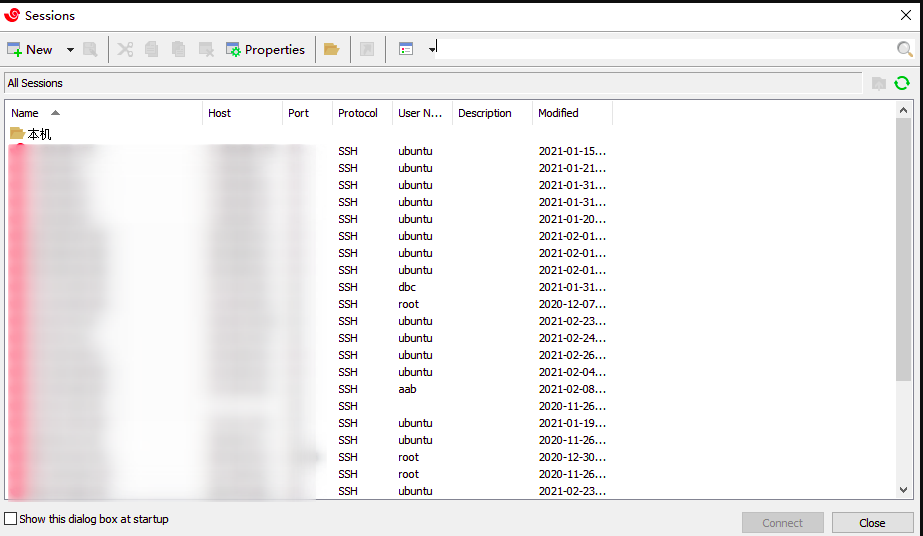

## How to rent a linux server?

### Create your account in dbchain

open `dbchain` website：[https://www.dbchain.ai/mywallet/myWallet](https://www.dbchain.ai/mywallet/myWallet)，and click `Create wallet account`:

input your passwd and click "Create":

Then, click "Key DOWNLOAD ENCRYPTED KEY" to **save your private key**， and click Continue, save your private key and finish.

After the above step, you will see the following page：

Click "How to buy DBC" and "How to get GAS" to choose your favourite way to buy some DBC to stake when rent CPU container and buy some GAS to pay for the tx fee.

When you get some DBC and GAS, you should bind your email accout before rent linux server: Click "MyMachine" and then click "Email":

After that, you should input your email address,  click "Receive email" and then input the DBC number sent by the email. Finally click Start binding.

### How to rent a server?

Open the rent GPU's page：[https://www.dbchain.ai/gpu/list](https://www.dbchain.ai/gpu/list)，click "Rent CPU container", and choose the way to pay: "Pledging method"。

Then , you should choose the mirror you want, how long you want to use etc. Finally click "Create order" to finished the rent.

You will receive an email to inform you how to login your server. You can also choose the following way to login your server.

## Login your linux server

1. In windows system，you can choose `xshell`, or any other tools you like to login your server. Just open xshell's [download page](https://www.netsarang.com/zh/xshell-download/), input your email to try for 30 days, and follow the email to download it.

2. Input server info to connect the server. After xshell is installed, open it and click "file" -> "New", and fill the following info, and click  Ok

   

3. Login to your server: 

   Click "file" -> "Open" and you will see a window showing your server info. Choose the one you just careted, input your user name and password to login.
   
   
   
   

