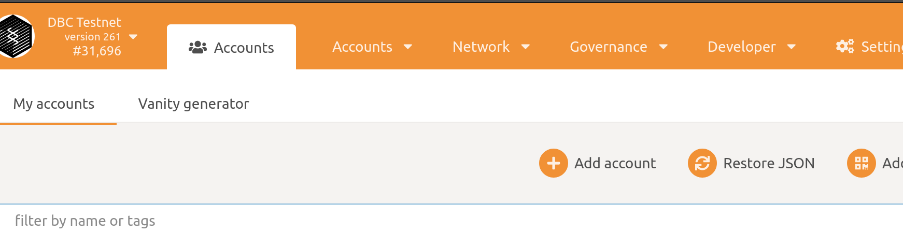
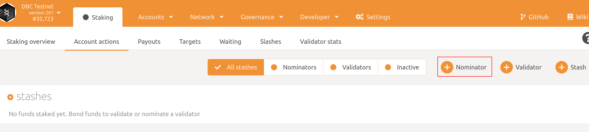

# 如何成为DBC提名人

1. 安装`polkadot{.js}`浏览器插件

   + Chrome, install via [Chrome web store](https://chrome.google.com/webstore/detail/polkadot{js}-extension/mopnmbcafieddcagagdcbnhejhlodfdd)
   + Firefox, install via [Firefox add-ons](https://addons.mozilla.org/en-US/firefox/addon/polkadot-js-extension/)

2. 生成一个帐号：您可以任选下面一种方式生成密钥

   1. 通过浏览器插件成

      点击`polkadot{.js}`插件图标 > 点击右上角`+`号 > 点击`Create New Account` > **记录下12个单词的助记词**，勾选`I have saved my mnemonic seed safely.` 点击`Next` >  输入账户的描述，并输入两次密码，完成账户创建。

   2. 通过网页生成

      打开[https://test.dbcwallet.io/?rpc=wss://infotest.dbcwallet.io#/explorer](https://test.dbcwallet.io/?rpc=wss://infotest.dbcwallet.io#/explorer)

      导航到`Accounts`，点击击`Add account`

      

      **保存您的助记词**，点击`已阅读`并点击Next; 然后给您的账户起一个容易分辨的名字，并设置密码。然后保存包含加密信息的json文件。

   3. 通过命令行生成

      ```shell
      subkey generate --scheme sr25519
      ```

      **请保存输出的信息。**

3. 登陆您的账户到`polkadot{.js}`插件

   + 如果是通过2.1生成的账户，略过这一步。

   + 如果是2.2生成的，可以通过导入`助记词`或者导入`json文件`进行导入。

   + 如果是通过subkey生成的，可以通过助记词导入。

4. 获取一定量的DBC

5. 打开[https://test.dbcwallet.io/?rpc=wss://infotest.dbcwallet.io#/explorer](https://test.dbcwallet.io/?rpc=wss://infotest.dbcwallet.io#/explorer) 导航到`Accounts > My accounts`您将能看到您的账户与余额

   

6. 提名验证人

   导航到`Network > Staking > Account actions`，点击`Nominator`

   

   在弹窗中设置 stash 账户，controller账户与`value bonded`，点击下一步

   

   

   接下来选择您要提名的验证人，点击左侧的账户，或者在输入框中输入地址，将您要提名的验证人添加到右侧（**您可以提名多个验证人**）。

   

   最后点击`Bond & Nominate`发送交易，完成提名。

7. 查看您提名的结果

   导航到`Network > Staking > Account actions`，您可以看到bond的DBC数目，与提名的候选人。

   

8. 第二次提名

   `步骤6`的提名实际上包含了两个步骤：`stash账户`设置`controller`账户 和 提名验证人。

   我们想要再次提名，只需要点击下方的`Nominate`进行提名这一个步骤即可：

   导航到`Staking > Account actions > stashes > Nominate`

   
   
   在弹出的选项中，选择你要提名的验证人：
   
   