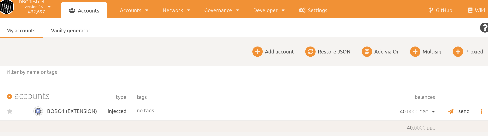

# How to nominate on DBC?

1. Install `polkadot{.js}` adds-on for your browser:

   + Chrome, install via [Chrome web store](https://chrome.google.com/webstore/detail/polkadot{js}-extension/mopnmbcafieddcagagdcbnhejhlodfdd)
   + Firefox, install via [Firefox add-ons](https://addons.mozilla.org/en-US/firefox/addon/polkadot-js-extension/)

2. Generate a stash account：you can choose any of the following methods:

   1. Generate by browser add-on `polkadot{.js}`

      click `polkadot{.js}` add-on > click `+` button > click `Create New Account` > **record the `Secret phrase`**，select `I have saved my mnemonic seed safely.` Click`Next` >  input the name of your account，input password twice，finished the account generate.

   2. Generate by Polkadot UI

      打开[https://test.dbcwallet.io/?rpc=wss://infotest.dbcwallet.io#/explorer](https://test.dbcwallet.io/?rpc=wss://infotest.dbcwallet.io#/explorer)

      navigate to`Accounts`，click `Add account`

      

      **Save your secret phrase**，select`Read` and click Next; Then give your account an easily distinguishable name and then set the password。After that, save the json file.

   3. generate an account by command line

      ```shell
      subkey generate --scheme sr25519
      ```

      **Please save the output of the command line**

3. Login to`polkadot{.js}` add-on

   + If you generate your account by step 2.1, you can skip this step.

   + If you generate your account by step 2.2, you can import your account by `Secret phrase` or by import json file.

   + If you generate by command line `subkey`, you can import your account by `Secret phrase`.

4. Get some DBC

5. Open [https://test.dbcwallet.io/?rpc=wss://infotest.dbcwallet.io#/explorer](https://test.dbcwallet.io/?rpc=wss://infotest.dbcwallet.io#/explorer) and navigate to`Accounts > My accounts` you can see your account and your balance:

   

6. Nominator

   Navigate to `Network > Staking > Account actions`, click `Nominator`

   

   set your stash account，controller account and`value bonded`，then click next

   

   

   then, you should select the validator. (**You can nominate more than one validator**).

   

   Finally click`Bond & Nominate to send the transaction and finished the nominate.

7. Check your nominate result

   Navigate to`Network > Staking > Account actions`, you can see the balance of bonded DBC and the validator you nominated.

   

8. Nominate the second time

   Nominate in `step 6` include two step: set `stash account` bond `controller` account and nominate a validator.

   If we want to nominate the second time, only need to click `Nominate` button：

   Navigate to `Staking > Account actions > stashes > Nominate`, select the validator you want to nominate. It's done!

