# A Guide to Staking and Managing DBC Nominations

Please take the time to carefully evaluate the UI and manage actions. This is not a complete guide to everything but intends to help answer common questions. This documentation has been updated from testnet to the mainnet. Make sure you are using mainnet tokens before sending to a mainnet wallet.

## Setup

Follow these basic steps to get up and running.

1. Generate stash account （If you already have stash account, you can skip this）

  + Option 1: Install `polkadot{.js}` adds-on

    + Chrome, install via [Chrome web store](https://chrome.google.com/webstore/detail/polkadot{js}-extension/mopnmbcafieddcagagdcbnhejhlodfdd)
      + [https://chrome.google.com/webstore/detail/polkadot{js}-extension/mopnmbcafieddcagagdcbnhejhlodfdd](https://chrome.google.com/webstore/detail/polkadot{js}-extension/mopnmbcafieddcagagdcbnhejhlodfdd)
    + Firefox, install via [Firefox add-ons](https://addons.mozilla.org/en-US/firefox/addon/polkadot-js-extension/)
      + [https://addons.mozilla.org/en-US/firefox/addon/polkadot-js-extension/](https://addons.mozilla.org/en-US/firefox/addon/polkadot-js-extension/)

    Then generate by `polkadot{.js}`

  + Option 2: Generate account from `Accounts > Accounts` [https://www.dbcwallet.io/#/accounts](https://www.dbcwallet.io/#/accounts)，click `Add account`.

  + Option 3: Generate by command line:

    ```bash
      curl --proto '=https' --tlsv1.2 -sSf https://sh.rustup.rs | sh
      cargo install --force subkey --git https://github.com/paritytech/substrate --version 2.0.1 --locked
    ```

2. Get some DBC.
  + Go to `Accounts > Accounts` [https://www.dbcwallet.io/#/accounts](https://www.dbcwallet.io/#/accounts).
  + Send DBC to your account.
  + Be sure you are sending mainnet tokens and not pre-swap NEO-based DBC.

## Managing DBC in the User Interface (UI)

### Checking Balance

Go to `Accounts > Accounts` in the main menu. Review account.


### Understanding Balance Details

Click the small down arrow next to the balance.
  + Transferrable: This is the amount of DBC that is not bonded and can be used for fees. It is important to always maintain a small amount of unbonded/transferrable funds.
  + Locked: The is the amount of DBC that is locked. It is not available for fees or transferring. Locked DBC includes the DBC that is bonded for nominating or in the process of being unbonded.
  + Bonded: Bonded DBC is DBC that is staked and used for nominations.
  + Unbonding: DBC being unbonded is in the process of moving from bonded to transferrable. This process can take up to seven (7) days.

  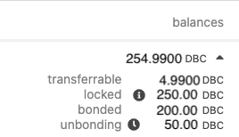

### Bonding and Unbonding

When DBC is added to the wallet it is unbonded. Bonding the DBC makes it available for staking to a validator. Always be sure to leave a few DBC unbonded (transferrable) to pay for fees when nominating or making other changes.

#### Bonding

Initial funds will be bonded when first nominating a validator. See the "Nominating a Validator" section below. To bond more funds:

1. Go to `Network > Staking`.

2. Click `Account actions`.

3. Click the three (3) dots to the right of the account and choose `Bond more funds`.

4. Select the amount of funds to bond from the stash account, remembering to leave some funds for fees.

5. Click `Bond more`.

#### Unbonding

Notice: This process takes up to seven (7) days. If immediate funds are needed for transactions and fees, reach out to the team and request assistance.

1. Go to `Network > Staking`.

2. Click `Account actions`.

3. Click the three (3) dots to the right of the account and choose `Unbond funds`.

4. Select the amount of funds to unbond from the controller account. These funds will no longer be available for staking.

5. Click `Unbond` and wait.

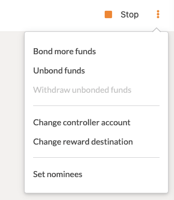

### Transferrable and Fees

Always maintain a small balance of DBC as transferrable to pay fees. Fees are very inexpensive so only a small amount is needed. Five (5) DBC is more than enough depending on the frequency of transactions.

As an example, changing nominated validators may cost 0.0003 DBC, leaving 4.9997 DBC for future transactions.

### Backup Wallet
Be sure to create a backup wallet for the https://www.dbcwallet.io/ account. This backup file will be used to add the account back to the interface if disconnected or add to the interface on a new browser or device.

## Nominating a Validator

1. Go to `Accounts > Accounts` [https://www.dbcwallet.io/#/accounts](https://www.dbcwallet.io/#/accounts) and ensure fund are bonded for staking:

  

2. Nominator

  If multiple validators are nominated the system will choose the most profitable validator(s) from the nominated group.

  + Navigate to `Network > Staking > Account actions` and click `Nominator`.

    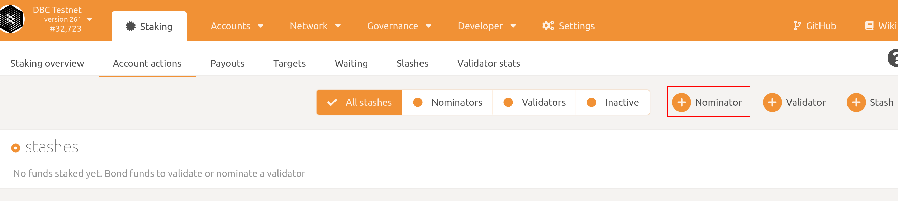

  + Set your stash account and controller account. Add an amount to `value bonded`，then click next. Remember to leave some funds for fees.
    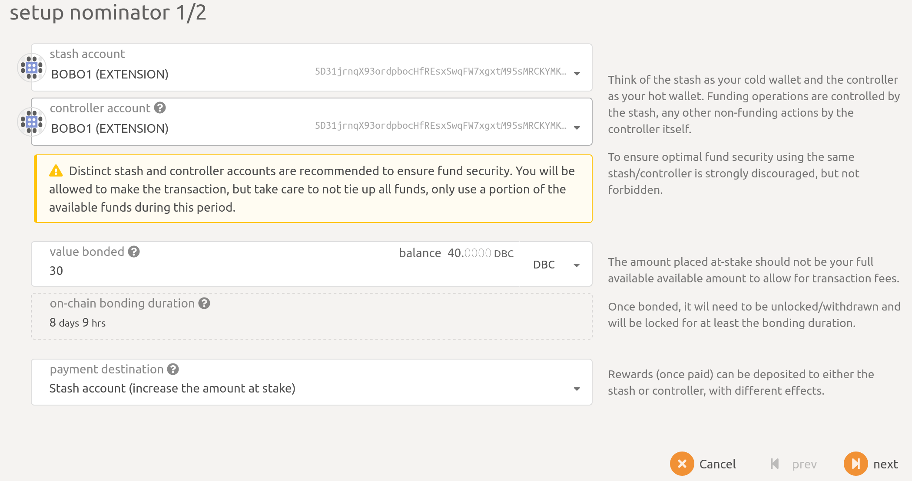

  + Select validators. (**You can nominate more than one validator**).

    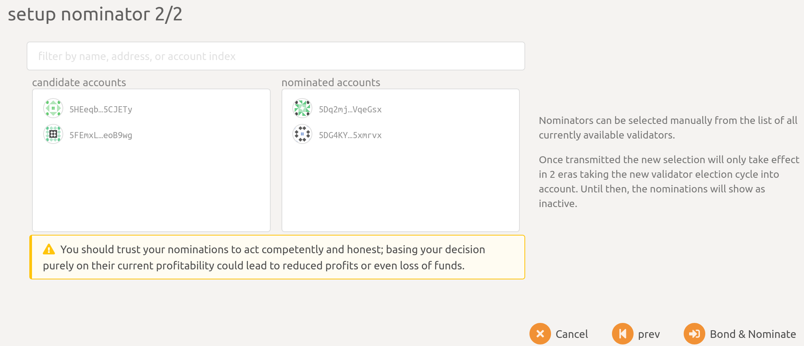

  + Finally click `Bond & Nominate` to send the transaction and finish nominating.

3. Check your nominate results.

  Navigate to `Network > Staking > Account actions`. You can see the balance of bonded DBC and the validator you nominated.

  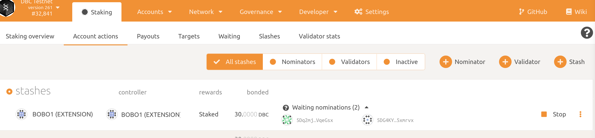

## Nominating New Validators

Active nomination will remain active until the end of the current era. Currently an era is 1 day. The new nominations will impact the validators you will be bonded to if selected during the next era. The progress of eras and epochs can be seen on the staking page at `Network > Staking > Overview`.

  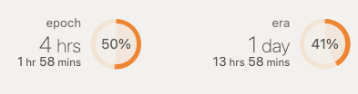

To change current nominations or add/remove nominated validators:

1. Go to `Network > Staking > Account actions`.

2. Click the three (3) dots to the right of the account and choose `Set nominees`.

  

3. Move validators to the right to nominate and to the left to remove as nominated validators.

  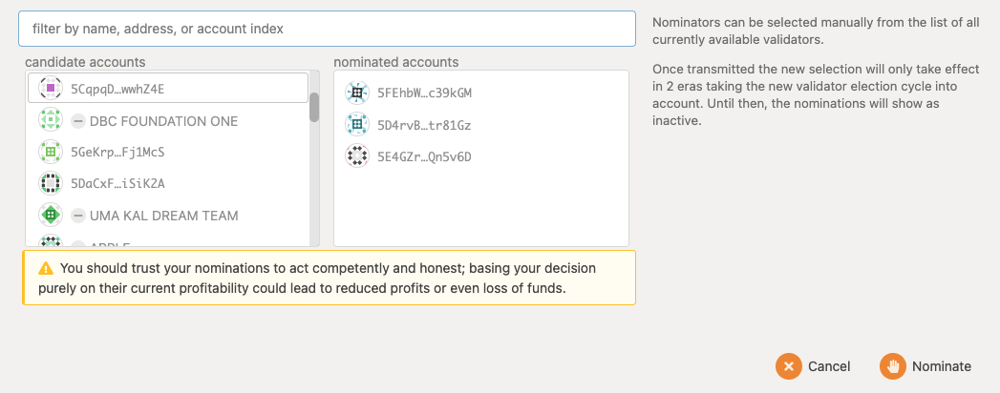

4. Select `Nominate`.

If an insufficient funds error occurs, check the "Managing DBC in the User Interface (UI)" of this document.

If multiple validators are nominated the system will choose the most profitable validator(s) from the nominated group.

Note: The `Stop` button will stop all nominations for that account. This action will activate at the end of the current era.

## Considerations When Choosing a Validator to Nominate

This section intends to educate on how nominators pay out and what impacts earning. It is not advice on what validators to nominate or how to manage investments.

### Top 21 Validators

The top 21 validators are selected for each era. Validators not in the top 21 are in the waiting list (`Network > Staking > Waiting`). The top validators are selected based on total DBC staked. This includes the DBC staked by the owner and any nominators. To see the owner bonded amount for a validator:

1. Go to the staking overview at `Network > Staking > Overview` or the waiting list at `Network > Staking > Waiting`.

2. Click the name of the validator on the left and select the down arrow to expand the balance details in the popup modal.

  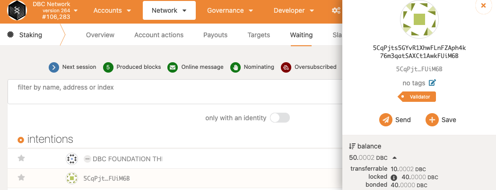

As a nominator, it is wise to balance the total staked DBC on validators when choosing. If a validator has lots of DBC staked, it will likely be selected for the next era but rewards will be split among more staked shares. If the staked DBC is too low, the validator may not be selected for the next era.

### Commission

Validators set a commission percentage for each era. It is important to note that a validator can set a new commission for the next era that does not match the current era. There is not currently an easy way to see future commission settings in the interface.

The commission is the percentage the validator receives from the nominator rewards. For example, if the nominator's share is 100 DBC for the last era and the validator's commission is set to 10%, the nominator will receive 90 DBC and the validator will receive 10 DBC in addition to what the validator earned from their own staked DBC. If the commission is set to 100%, the nominator will receive no reward.

### Validator Stats

Validator stats can be a handy way to evaluate which validators to nominate. These stats can show past earnings, slashes, commissions, and more. Stats only show the past but can be handy in judging likely outcomes for future eras, such as changing commissions.

1. Go to the staking overview at `Network > Staking > Overview` or the waiting list at `Network > Staking > Waiting`.

2. Click on a validator name. Select and copy the address of the validator in the popup modal.

  

3. Go to the stats page `Network > Staking > Validator stats`.

4. Paste the validator address into the field and click the arrow.

  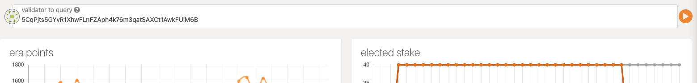

### Validator Settings for the Next Era

Commission and other validator stats for the next era are not easily accessible in the interface. Hopefully, this can be added in the future. For now, use current and past stats to choose the best validator for you.

### Getting Rewards

Rewards are only earned when a validator you nominated was selected for an era. Once the era is complete, the rewards can be paid out. Rewards are not paid out automatically, but anyone can trigger payout from a validator.

1. Go to `Network > Staking > Payouts`. If there are no pending payouts, you did not yet receive rewards or they have already been paid.

2. Click a payout.

  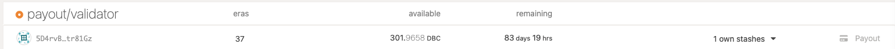

3. In the popup modal, choose your account that will pay the fees (`request payout from`) and the staker that will payout (`payout stakers for (single)`). Click `Payout`.

  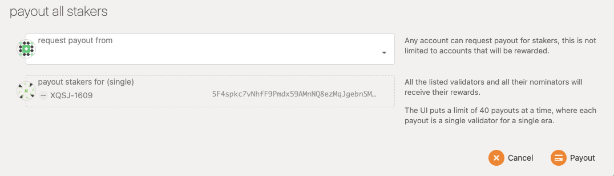

4. In a new popup modal, review the infomration and fee. The fee is in mico DBC (1/1,000,000). If the fee is 150 micro DBC you will pay 0.00015 DBC. The requester pays the fee but the payout will come from the validator. Enter your account password and click `Sign and Submit`.

  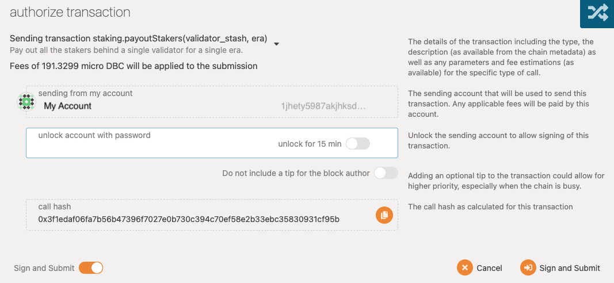

5. Check back later for your rewards. It should only take a few minutes but depends on chain congestion. Once paid out, rewards are added to the bonded balance of your account.

### Calculating Earnings Share

The total earnings of a validator are determined by the work it does, if there are slashes, and a number of other factors. The point of this section is to calculate your share of the reward, not the actual amount that is based on validator performance.

The reward received from a validator is distributed based on your share the total staked DBC. If the validator has 10M DBC staked and 1M DBC of that is yours, you will receive 10% minus commission. If the validator earned 10,000 DBC your share is 1,000 DBC. However, if the validator has a 30% commission, your share is reduced by 30% to 700 DBC. The other 300 is rewarded to the validator.

  ```
    y = your stake for the validator
    v = validator own stake
    n = all nominator stake (including yours)
    e = earned rewards for the validator during the era
    c = commission percentage (if 70%, c = 70)
    r = your rewards

    r = ((e / (v + n)) * y) * ((100 - c) / 100)
  ```
