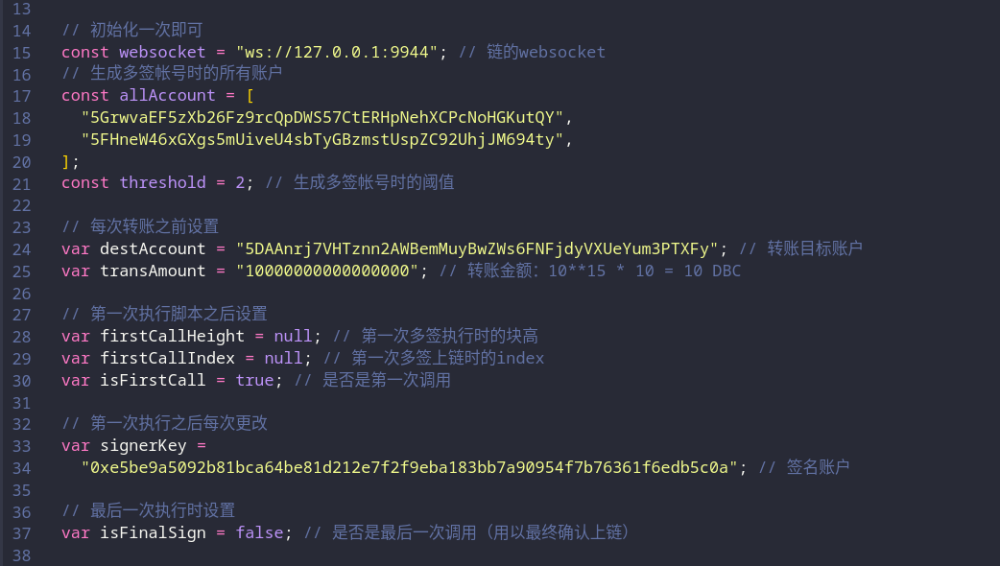
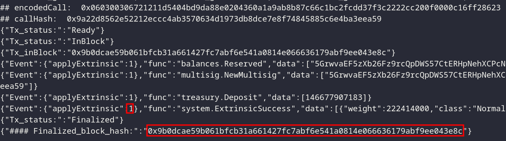
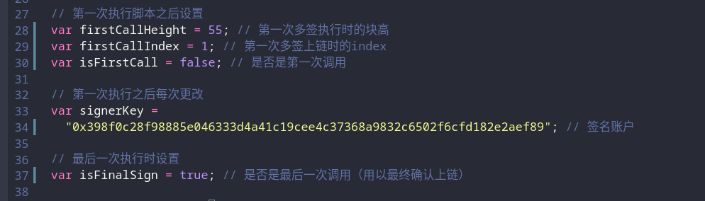

### 如何加密/解密

```shell
# 生成box_pubkey

# 生成一个发送者账户
❯ subkey generate --scheme sr25519
Secret phrase `sea clerk fortune obscure energy worry country vanish left unhappy ceiling finger` is account:
  Secret seed:       0x0cdc17e4cd84743c66bae7761ad354d423c93ac1e398630575d91371d6f713ce
  Public key (hex):  0xcca1afe4f55ad20ac23d03d619fb66c26708bf06dd3431f7e15dd44f48a8f408
  Public key (SS58): 5Gh1f3X4aQoyeMymGW2unqv5pjaMbaLrTFm4WiP8fhDHphqg
  Account ID:        0xcca1afe4f55ad20ac23d03d619fb66c26708bf06dd3431f7e15dd44f48a8f408
  SS58 Address:      5Gh1f3X4aQoyeMymGW2unqv5pjaMbaLrTFm4WiP8fhDHphqg

# 生成一个接受者账户
❯ subkey generate --scheme sr25519
Secret phrase `clump favorite today beyond outdoor glimpse chuckle hedgehog sure tiger deny shuffle` is account:
  Secret seed:       0x171baa0f7baa4fa7e2dd94b8f9efc0b95034a4ad5f3aba5b6b923e38130c3f0d
  Public key (hex):  0x68cacbfe17fc785d2882d16ff9d711f042328a701987c8f6f744288d22d85436
  Public key (SS58): 5ES75cmrZhPxcy1WWPDa4tRb8MU9qwrK7Pe5BgWKmRawuHo2
  Account ID:        0x68cacbfe17fc785d2882d16ff9d711f042328a701987c8f6f744288d22d85436
  SS58 Address:      5ES75cmrZhPxcy1WWPDa4tRb8MU9qwrK7Pe5BgWKmRawuHo2

# 发送者账户生成box_pubkey
node gen_boxpubkey.js --key 0x0cdc17e4cd84743c66bae7761ad354d423c93ac1e398630575d91371d6f713ce
0xe30cac79ec5fe7c9811ed9f1a18ca3806b22798e24b7d9f9424b1a27bde3e866

# 接收者账户生成box_pubkey
node gen_boxpubkey.js --key 0x171baa0f7baa4fa7e2dd94b8f9efc0b95034a4ad5f3aba5b6b923e38130c3f0d
0x20da91ba45f5ed8fddd40d5439f817c9f00750694ed5c70d17e421caf15f437b

# 发送者加密信息，其中，--sender_privkey为发送者私钥；--receiver_box_pubkey为接收者box_pubkey
node seal_msg.js --sender_privkey 0x0cdc17e4cd84743c66bae7761ad354d423c93ac1e398630575d91371d6f713ce --receiver_box_pubkey 0x20da91ba45f5ed8fddd40d5439f817c9f00750694ed5c70d17e421caf15f437b --msg "abcdefg bcdefa"

# 接收者解密信息： 其中，--sender_box_pubkey 为发送者box_pubkey，--receiver_privkey为接收者私钥
node open_msg.js --sender_box_pubkey 0xe30cac79ec5fe7c9811ed9f1a18ca3806b22798e24b7d9f9424b1a27bde3e866 --receiver_privkey 0x171baa0f7baa4fa7e2dd94b8f9efc0b95034a4ad5f3aba5b6b923e38130c3f0d --sealed_msg 0x01405deeef2a8b0f4a09380d14431dd10fde1ad62b3c27b3fbea4701311d
```

### 委员会如何查询数据

```bash
# 查询onlineCommittee模块的committeeMachine:
node query_committee_storage.js --port wss://preinfo.dbcwallet.io --type-file ../../dbc_types.json --rpc-file ../../dbc_rpc.json --module onlineCommittee --func committeeMachine 5DdA3eHdWKuHLjqEquKQzyvhumNBEN32RxRWkuuaFvda474S

# 查询onlineCommittee模块的machineCommittee
node query_committee_storage.js --port wss://preinfo.dbcwallet.io --type-file ../../dbc_types.json --rpc-file ../../dbc_rpc.json --module onlineCommittee --func machineCommittee a0117989bd823e512eb63f65585b21a241755e117bf794261890ca0578070930
```

### 如何查询某个高度数据

```bash
# 查询某个高度(8800)时，onlineCommittee模块的committeeMachine
node query_storage.js --port wss://galaxytest.congtu.cloud --type-file ../../dbc_types.json --rpc-file ../../dbc_rpc.json --module onlineCommittee --func committeeMachine --at-height 8800 5He35goba34RReW9WZT3xEjHNY9mo4DpqWTRXzNsR4Y1X7xF
```

### 批量租用机器

- 租用机器需要租用，确认租用成功两个步骤

```bash
# 1. 修改test_txRent.js脚本中 `machineList`字段为需要租用的机器ID，用--key指定租用人的私钥，--day 指定租用天数，--type-file 指定链type文件。如
node test_txRent.js --key 0xe5be9a5092b81bca64be81d212e7f2f9eba183bb7a90954f7b76361f6edb5c0a --day 2 --type-file ../../dbc_types.json

# 2 修改 test_txConfirm.js 脚本中 `machineList`字段为需要确认租用的机器ID, 用--key指定租用人的私钥，--type-file 指定链type文件。如
node test_txConfirm.js --key 0xe5be9a5092b81bca64be81d212e7f2f9eba183bb7a90954f7b76361f6edb5c0a --type-file ../../dbc_types.json
```

### 多签脚本说明

- 多签脚本需要自己手动修改以整合到项目中

- 步骤 1: 修改脚本内容，第一次执行脚本: `node tx_by_multi_sig.js`
- 步骤 2: 记录第一次脚本输出，并修改脚本内容，再次执行脚本

例子：

1. 生成多签账户

```
  Alice:
    seed: 0xe5be9a5092b81bca64be81d212e7f2f9eba183bb7a90954f7b76361f6edb5c0a
    account: 5GrwvaEF5zXb26Fz9rcQpDWS57CtERHpNehXCPcNoHGKutQY

  Bob:
    seed: 0x398f0c28f98885e046333d4a41c19cee4c37368a9832c6502f6cfd182e2aef89
    account: 5FHneW46xGXgs5mUiveU4sbTyGBzmstUspZC92UhjJM694ty

  阈值设置为2，生成的多签账户为：
  5F3QVbS78a4aTYLiRAD8N3czjqVoNyV42L19CXyhqUMCh4Ch
```

注意： 多签账户需要有币来支付手续费

2. 修改脚本：



执行脚本即可完成第一次调用,结果如图



其中，applyExtrinsic: 1，即为 index，可通过 Finalized_block_hash 查询对应 block_height，在这次测试中，块高为 55

执行完第一次之后，前端可以看到：


第一次执行完之后，需要修改脚本参数为：



再次执行脚本即可

3. 如果有超过 2 个钱包，在第一次，和最后一次调用之间，修改 firstCallHeight, firstCallIndex 和 signaerKey 即可
